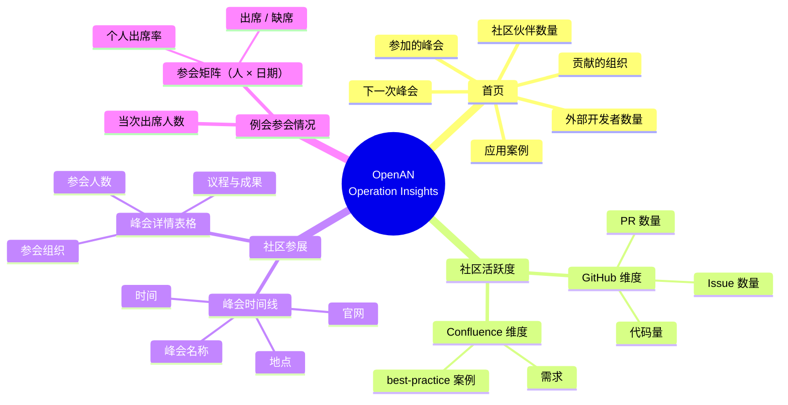
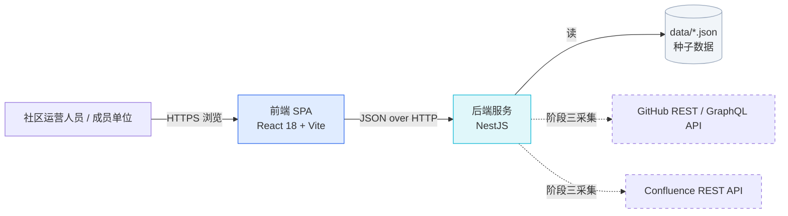
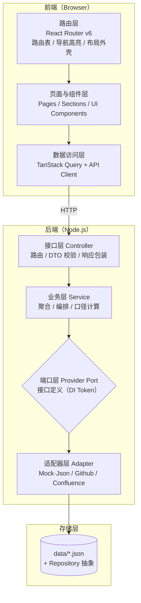
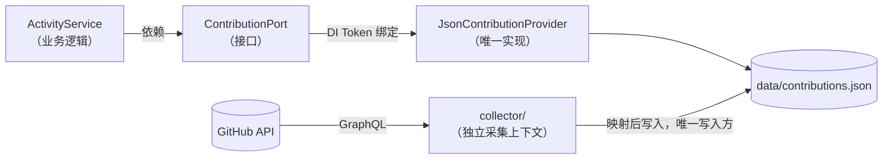
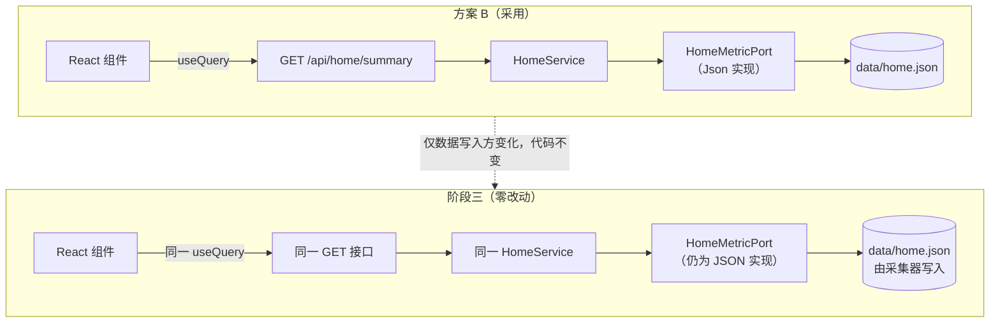
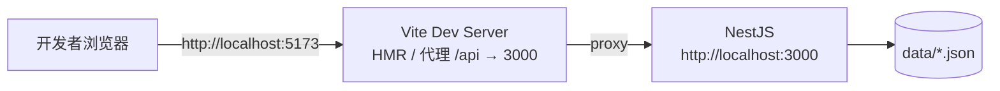
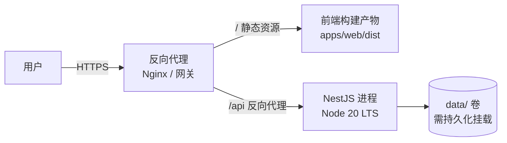
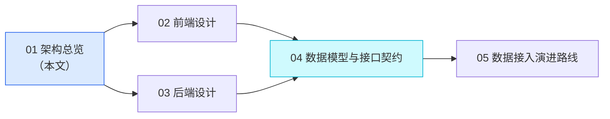

# 01 · 架构总览

> OpenAN Community Operation Insights（社区运营洞察平台）
> 文档版本：v1.0 ｜ 状态：已评审 ｜ 适用范围：全栈架构基线

---

## 1. 文档目的与范围

本文档定义 OpenAN 社区运营洞察平台的**整体架构基线**，包括系统分层、技术选型、架构原则、部署形态与工程目录约定。它回答三个问题：

1. 系统由哪些部分组成，各部分之间如何通信？
2. 为什么选择这些技术，替代方案是什么？
3. 当前阶段（数据硬编码/占位）与后续阶段（接入真实数据源）如何做到平滑过渡？

阅读本文后，读者应能理解 `02-frontend-design.md`、`03-backend-design.md` 中的设计决策依据。

### 1.1 本期范围（Scope）

| 范围 | 内容 |
| --- | --- |
| 交付物 | `docs/` 下的架构设计文档（Markdown） |
| 数据形态 | 全部通过后端返回；后端数据源为 `data/*.json` 种子文件（即"硬编码"） |
| 外部系统 | GitHub、Confluence **仅定义端口与适配器契约**，不实现真实调用 |

### 1.2 非目标（Non-Goals）

以下内容**明确不在本期范围**，避免范围蔓延：

- 不创建前端或后端工程脚手架，不安装依赖，不编写业务代码。
- 不实现用户登录、权限体系与多租户（当前为公开看板形态）。
- 不引入关系型数据库、缓存中间件、消息队列等基础设施。
- 不做数据写入的后台管理界面（数据维护在后续阶段通过 JSON 文件或采集任务完成）。
- 不实现国际化多语言（预留 `i18n` 目录约定，本期仅中文）。

---

## 2. 项目背景

OpenAN 是一个开放协作社区，其运营工作长期面临信息分散的问题：

- 社区规模数据（伙伴数、开发者数、应用案例数）散落在文档与人工统计表中；
- 各成员单位对社区的贡献（PR、Issue、代码量、需求、最佳实践）缺少统一口径的汇总视图；
- 历次峰会信息（时间、地点、官网、参会组织）缺少可检索、可追溯的沉淀载体。

本平台将这些信息集中到一个**后台看板式网站**中，供社区运营团队与成员单位查看。网站结构极其简单——顶部导航栏 + 内容区，四个一级页面：

| 页面 | 路由 | 核心价值 |
| --- | --- | --- |
| 首页 | `/` | 一屏看清社区整体规模与最近动态 |
| 社区活跃度情况 | `/activity` | 按组织维度对比贡献度 |
| 社区参展 | `/summits` | 时间线回顾历次峰会并查看明细 |
| 例会参会情况 | `/meetings` | 例会出席矩阵（人 × 日期） |

---

## 3. 系统能力总览



---

## 4. 系统上下文（Context）

系统对外只依赖两个外部数据源，且全部调用均发生在**后端**，前端不接触任何第三方接口与凭据。



**关键约束**：

- 前端仅有**一个**后端基地址（通过 `VITE_API_BASE_URL` 注入），不存在直连 GitHub/Confluence 的路径。
- 所有凭据（GitHub Token、Confluence 账号）只存在于后端环境变量中。

---

## 5. 分层架构

系统采用经典四层结构，前端与后端各自内部同构分层，层与层之间单向依赖（上层依赖下层，下层不感知上层）。



### 5.1 各层职责

| 层 | 前端 | 后端 | 禁止事项 |
| --- | --- | --- | --- |
| 接口/路由层 | 路由表、布局外壳、导航高亮、路由级懒加载 | Controller：仅做参数绑定与校验，不含业务逻辑 | 在 Controller 中直接读文件或调外部 API |
| 业务/页面层 | Page 组件只负责组合 Section，Section 负责单一区块渲染 | Service：口径计算（如"代码量 = additions + deletions"）、多数据源合并、排序分页 | 在 Service 中硬编码具体数据源的字段名 |
| 数据/端口层 | TanStack Query hooks 封装，统一 queryKey | Provider Port 接口 + DI Token | 在 UI 组件中直接 `fetch` |
| 适配器/存储层 | API Client（axios 实例、拦截器） | Adapter 实现（JSON Repository、GitHub Client） | 前端组件感知后端内部结构 |

> **依赖倒置要点**：Service 依赖的是 **Provider 接口**，而不是具体实现。这是本架构可替换性的根基，详见第 7 节。

---

## 6. 技术选型

### 6.1 选型总表

| 层次 | 选型 | 版本基线 | 说明 |
| --- | --- | --- | --- |
| 前端框架 | React | 18.x | 用户指定；生态成熟，图表/表格/时间线组件丰富 |
| 前端语言 | TypeScript | 5.x | 强类型贯穿前后端，契约可用类型表达 |
| 前端构建 | Vite | 5.x | 冷启动快，HMR 体验好，构建产物为纯静态资源 |
| 前端路由 | React Router | 6.x | 四个一级路由 + 可选详情路由，支持 `NavLink` 高亮 |
| 前端数据获取 | TanStack Query (React Query) | 5.x | 统一缓存、去重、失效、重试与加载/错误态，避免手写 useEffect 数据流 |
| 前端样式 | Tailwind CSS + tailwind-merge + tailwindcss-animate | 3.4.17 | 原子化样式，便于统一卡片/表格/时间线视觉语言 |
| 前端组件 | shadcn/ui 风格本地组件 | — | 组件源码内置于仓库，可完全掌控视觉细节 |
| 前端图标 | lucide-react、react-icons | — | 图标统一来源 |
| 前端图表 | Recharts / ECharts | — | 组织贡献排行条形图、组织贡献占比环形图 |
| 后端框架 | NestJS | 10.x | 用户指定 Node.js；模块化 + DI 天然适配"可替换数据提供者"诉求 |
| 后端语言 | TypeScript | 5.x | 与前端共享类型定义与契约 |
| 入参校验 | class-validator / class-transformer | — | DTO 白名单校验与类型转换 |
| 配置管理 | @nestjs/config | — | 环境变量集中管理与校验 |
| 缓存（预留） | @nestjs/cache-manager（内存实现） | — | 降低接口重复读取开销；上游限流应对在采集侧（见 05 文档 2.5 节） |
| 外部调用 | 原生 `fetch`（无第三方 SDK） | — | 采集器直连 GitHub GraphQL，未引入 `@octokit` |
| 数据存储 | **JSON 文件**（`data/*.json`） | — | 用户指定，不引入数据库 |
| 文档产出 | Markdown（`docs/`） | — | 本期唯一交付物 |

### 6.2 关键选型理由与替代方案对比

#### 6.2.1 后端为什么选 NestJS 而非 Express

| 维度 | NestJS | Express | 结论 |
| --- | --- | --- | --- |
| 模块边界 | 内置 Module，天然按业务域隔离 | 需手工组织目录与路由注册 | NestJS 胜 |
| 依赖注入 | 内置 IoC 容器，`provide/useClass` 一行切换实现 | 需引入第三方或手工工厂 | NestJS 胜：绑定集中于 `ProvidersModule`，业务模块零改动 |
| 横切关注点 | Guard / Interceptor / Pipe / Filter 一等公民 | 需自行串联中间件 | NestJS 胜 |
| 学习成本 | 略高，概念较多 | 极低 | Express 胜 |
| 与前端语言一致性 | 同为 TS，可共享 `types` 包 | 同 | 平 |

**决策**：选 NestJS。本项目最核心的架构诉求是"本阶段用 JSON 种子数据、后续换成真实 GitHub/Confluence 数据，且业务层与前端零改动"。实现分两层：DI 容器让"换实现"成为一行配置（用于更换存储、或确需直连上游时）；而数据源接入本身走读写分离（采集器写、接口读，见 7.1 节），因此 `Service` 与 `Controller` 在三个阶段中代码完全不变。

#### 6.2.2 数据存储为什么可以用纯 JSON 文件

| 维度 | JSON 文件 | SQLite | PostgreSQL |
| --- | --- | --- | --- |
| 部署复杂度 | 零依赖 | 零依赖（嵌入式） | 需独立服务 |
| 数据结构演进 | 直接改 JSON 结构 | 需 migration | 需 migration |
| 并发写能力 | 弱（需串行化，见 03 文档） | 中 | 强 |
| 查询能力 | 全量加载到内存后过滤 | SQL | SQL + 索引 |
| 适用数据量 | ≤ 万级记录 | ≤ 百万级 | 无上限 |

**决策**：选 JSON 文件。当前数据规模极小（组织数十个、峰会十余场），且写入频率极低（人工维护或定时采集）。关键在于**用 Repository 抽象包住读写**，使存储实现可替换——后续若数据量增长，只需新增一个 `Prisma*Repository` 实现同一接口。

#### 6.2.3 前端为什么统一走接口而不在前端写死常量

这是本架构中最重要的一个决策，详见 7.3 节。

---

## 7. 架构原则

### 7.1 原则一：端口-适配器（Ports & Adapters）

在 Service 与具体数据源之间插入一层**端口（Port）**——一个纯 TypeScript 接口。Service 只依赖端口，端口的具体实现（适配器）通过 DI Token 注入。



**收益**：

- 业务逻辑对数据来源无感知，不因字段口径变化而修改；
- 单元测试可注入 `InMemoryProvider`，无需 mock HTTP；
- 更换实现（如存储由 JSON 换成数据库）是一个 **1 行的模块配置变更**，不是一次重构；
- 接入真实数据源则**连这一行都不需要**：采集器写入同一份 JSON 结构，端口实现保持不变（见 7.3 节与 05 文档 2.5 节）。

### 7.2 原则二：契约优先（Contract First）

接口字段按**真实数据源的语义**设计，而不是按当前 Mock 数据的便利性设计。例如组织头像字段命名为 `logoUrl` 并明确其对应 GitHub 的 `avatar_url`，贡献字段命名为 `pullRequests`（明确指"已合并 PR 数"）而非含糊的 `prCount`。

**收益**：阶段三接入 GitHub 时，只需在适配器内做一次字段映射，Controller、DTO、前端组件完全不动。

### 7.3 原则三：单一数据入口（Single Source of Truth via API）

**前端不写死任何 fixture，所有数据（包括"暂时硬编码"的部分）一律通过后端接口获取。**

用户需求中提到"这些数据暂时硬编码"，但硬编码的**位置**有两种选择：

| 方案 | 做法 | 后果 |
| --- | --- | --- |
| A. 前端写死 | 硬编码常量放在 React 组件或 `fixtures.ts` | 后续接真实数据时，需逐个组件改为请求，**前端全面返工**；且"贡献的组织"已走接口，形成两套数据路径 |
| B. 后端写死（采用） | 数据放 `data/*.json`，后端读取后经接口返回 | 前端从第一天起即为最终形态；替换数据源只改后端绑定 |

**决策**：采用方案 B。

**代价与收益权衡**：初版多一次 HTTP 往返与文件读取（实际因内存缓存，开销可忽略）。换来的是**前端零返工**——这是整个架构中最划算的一笔交易。



### 7.4 原则四：统一响应信封（Envelope）

所有 REST 响应统一包裹为 `{ code, message, data }`。目的是让后续"加分页、加错误码、加提示信息"不破坏前端解析逻辑。

### 7.5 原则五：不过度抽象

四个页面、七个数据文件、两个预留数据源——这是一个**小系统**。架构上只引入必要的抽象（Provider 端口、Repository），不引入 DDD 聚合根、CQRS、事件总线等重型范式。

---

## 8. 部署形态与运行拓扑

### 8.1 开发环境



- Vite 通过 `server.proxy` 将 `/api` 前缀转发到后端，避免开发期 CORS 配置负担。
- 后端 `main.ts` 开启全局 `ValidationPipe` 与统一异常过滤器。

### 8.2 生产环境



**部署要点**：

1. 前端产物为纯静态文件，可托管于任意静态服务器或 CDN；
2. 前后端同域部署（网关按路径分流），从而**无需 CORS**；
3. `data/` 目录必须以**持久化卷**方式挂载，不可打包进镜像（否则更新丢失），且需纳入备份；
4. 前端构建时注入 `VITE_API_BASE_URL`（同域部署时设为 `/api`）。

### 8.3 运行时配置矩阵

| 配置项 | 位置 | 前端可见 | 说明 |
| --- | --- | --- | --- |
| `VITE_API_BASE_URL` | 前端构建期 | ✅ | API 基地址，同域部署填 `/api` |
| `PORT` | 后端运行时 | ❌ | NestJS 监听端口，默认 3000 |
| `DATA_DIR` | 后端运行时 | ❌ | JSON 数据目录，默认 `<repo>/data` |
| `CORS_ORIGINS` | 后端运行时 | ❌ | 非同域部署时的允许来源，逗号分隔 |
| `GITHUB_TOKEN` | 后端运行时 | ❌ | 阶段三使用，本期留空 |
| `GITHUB_ORGS` | 后端运行时 | ❌ | 阶段三使用，待采集组织列表 |
| `CONFLUENCE_BASE_URL` / `CONFLUENCE_TOKEN` | 后端运行时 | ❌ | 阶段三使用 |
| `CACHE_TTL_SECONDS` | 后端运行时 | ❌ | 缓存有效期，默认 300 |

> **安全红线**：任何以 `VITE_` 前缀的变量都会被编译进前端产物，**严禁**在其中放置任何凭据。

---

## 9. 命名规范与编码约定

| 对象 | 规范 | 示例 |
| --- | --- | --- |
| 前端页面组件 | PascalCase + `Page` 后缀 | `HomePage.tsx`、`ActivityPage.tsx` |
| 前端区块组件 | PascalCase + `Section` 后缀 | `HomeMetricSection.tsx` |
| 前端 hooks | camelCase + `use` 前缀 | `useHomeSummary()` |
| 后端模块 | kebab-case 目录 + PascalCase 类 | `modules/home/home.module.ts` |
| Controller / Service | PascalCase + 后缀 | `HomeController`、`ActivityService` |
| Provider 端口 | PascalCase + `Port` 后缀 | `ContributionPort` |
| Provider 适配器 | `来源 + 业务 + Provider` | `JsonContributionProvider`、`JsonSummitProvider` |
| DI Token | 大写下划线常量 | `CONTRIBUTION_PORT` |
| DTO | PascalCase + `Dto` 后缀 | `GetContributionsQueryDto` |
| JSON 数据文件 | 全小写，单数名词 | `home.json`、`organizations.json`、`meetings.json` |
| API 路径 | 全小写，复数资源名 | `/api/summits`、`/api/organizations` |
| 时间字段 | ISO 8601 字符串，UTC | `"2026-09-18T09:00:00Z"` |
| 布尔字段 | `is` / `has` 前缀 | `isUpcoming`、`hasDetail` |

---

## 10. 目标工程结构（约定，本期不创建）

```text
openan-operation-insights/
├── docs/                                  # ★ 本期交付物
│   ├── README.md
│   ├── 01-architecture-overview.md
│   ├── 02-frontend-design.md
│   ├── 03-backend-design.md
│   ├── 04-data-and-api-contract.md
│   └── 05-integration-roadmap.md
│
├── data/                                  # JSON 种子数据（运行时被后端读取）
│   ├── source/                            # 人工维护的源台账（采集器输入，非契约文件）
│   │   └── meetings.xlsx                  # 例会参会台账（运营手工更新）
│   ├── home.json                          # 首页指标 + 下一次峰会
│   ├── organizations.json                 # 组织档案（伙伴 / 外部开发者）
│   ├── contributions.json                 # 组织 × 贡献指标（GitHub 类）
│   ├── insights.json                      # 组织 × Confluence 类指标
│   ├── contributors.json                  # 个人贡献者档案（GitHub 账号维度）
│   ├── summits.json                       # 峰会列表 + 详情
│   └── meetings.json                      # 例会参会矩阵（人 × 日期）
│
├── apps/
│   ├── web/                               # React 18 + TS + Vite
│   │   ├── index.html
│   │   ├── vite.config.ts                 # server.proxy: /api → :3000
│   │   └── src/
│   │       ├── main.tsx
│   │       ├── App.tsx                    # 路由表
│   │       ├── layouts/AppLayout.tsx      # Navbar + <Outlet/> + Footer
│   │       ├── pages/                     # HomePage / ActivityPage / SummitsPage / MeetingsPage
│   │       ├── sections/                  # 页面内区块（一区块一文件）
│   │       ├── components/ui/             # Button / Card / Table / Badge / Skeleton …
│   │       ├── features/                  # 按业务域的 hooks + api 封装
│   │       ├── lib/                       # apiClient / formatters / queryClient
│   │       └── types/                     # 与后端共享的契约类型
│   │
│   └── api/                               # NestJS 10
│       ├── src/
│       │   ├── main.ts
│       │   ├── app.module.ts
│       │   ├── modules/
│       │   │   ├── home/                  # home.module / controller / service
│       │   │   ├── activity/
│       │   │   ├── summit/
│       │   │   └── meeting/               # 例会参会矩阵
│       │   ├── providers/                 # ★ 端口接口 + 适配器实现
│       │   │   ├── ports/                 # contribution.port.ts 等纯接口
│       │   │   ├── json/                  # json-*.provider.ts（唯一实现）
│       │   │   └── providers.module.ts    # 端口 → 适配器绑定
│       │   ├── collector/                 # ★ 采集器（独立上下文，写 data/*.json）
│       │   ├── scripts/                   # 采集脚本（import-meetings.ts：xlsx → meetings.json）
│       │   ├── repositories/              # JsonRepository（原子写 + 串行队列）
│       │   ├── common/                    # 响应包装 / 异常过滤器 / 错误码
│       │   └── config/                    # 配置加载与校验
│       └── test/
│
├── package.json                           # 可选：npm workspaces 统一脚本
└── README.md                              # 项目说明与启动指南
```

**结构约定说明**：

- `docs/` 是本期唯一实际产物；其余目录为后续实现的落点约定，命名需严格遵循，以保证本文档与实现一致。
- 是否采用 npm workspaces 由实现阶段决定，本架构不做强制要求（前后端各自独立目录亦可工作）。
- `apps/web/src/types` 与 `apps/api/src/modules/*/dto` 是契约的**两个端**，字段名必须与 04 文档完全一致。

---

## 11. 质量属性与保障策略

| 质量属性 | 目标 | 保障手段 |
| --- | --- | --- |
| 可维护性 | 新增一个数据源不改业务层 | Provider 端口 + DI Token |
| 可演进性 | 种子数据 → 真实采集，前端与业务层零改动 | 契约优先 + 单一数据入口 + 读写分离 |
| 性能 | 页面接口 P95 < 100ms（本地数据） | JSON 内存缓存、前端 Query 缓存 |
| 可靠性 | JSON 文件不因并发写损坏 | 原子写 + 串行写队列 + schema 校验 |
| 安全性 | 凭据不泄漏到前端 | 凭据仅后端环境变量；`VITE_` 前缀禁令 |
| 可观测性 | 采集失败可定位 | 结构化日志（level + 上下文 + 状态码） |
| 一致性 | 前后端字段零偏差 | 04 文档作为唯一契约来源，Code Review 校验 |

---

## 12. 主要风险与对策

| 风险 | 影响 | 概率 | 对策 |
| --- | --- | --- | --- |
| 硬编码数据口径与 GitHub 真实口径不一致 | 阶段三出现数据"跳变"，用户困惑 | 中 | 契约按真实语义设计；在 UI 上标注"数据更新时间"；阶段三提供口径说明 |
| 组织标识不统一（同一公司在 GitHub / Confluence 命名不同） | 贡献数据无法归并 | 高 | 建立 `organizationAlias` 映射表（见 04 文档），以 `orgId` 为唯一主键 |
| JSON 文件被并发写损坏 | 服务不可用 | 低 | 原子写 + 串行队列 + 启动校验 + 校验失败降级只读 |
| GitHub API 限流（5000 req/h） | 采集失败 | 中 | ETag 条件请求 + 增量拉取 + TTL 缓存 + GraphQL 批量查询（见 05 文档） |
| 数据文件未持久化导致更新丢失 | 数据回退 | 中 | 部署时强制挂载持久化卷 + 纳入备份 |
| 页面数据量增长后前端卡顿 | 体验下降 | 低 | 表格虚拟滚动、图表数据 `useMemo` 派生、分页接口预留 |
| 例会矩阵无人事主键（列名即人名，ADR-0005） | 改名/重名/空格差异产生重复列，出席率静默算错；接入 Zoom 需从零重建映射 | 中 | 台账侧人工保证列名一致；ADR-0005 标记为已知负债；接入 Zoom 前先补 `personId` |

---

## 13. 与其他文档的关系



| 文档 | 回答的问题 | 主要读者 |
| --- | --- | --- |
| 01 架构总览（本文） | 整体长什么样，为什么这么设计 | 所有人、评审者 |
| 02 前端设计 | 页面怎么拆，数据怎么取，视觉规范如何 | 前端工程师、设计师 |
| 03 后端设计 | 模块怎么分，端口怎么定义，存储怎么写 | 后端工程师 |
| 04 数据模型与接口契约 | 字段叫什么，接口长什么样 | 前后端工程师（**必读**） |
| 05 数据接入演进路线 | 怎么接 GitHub 和 Confluence | 后端工程师、运营负责人 |
