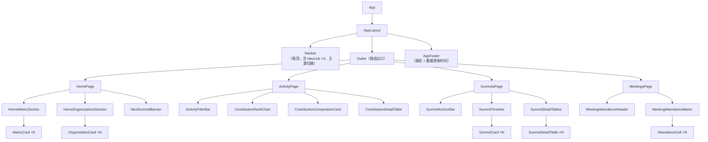

# 02 · 前端设计

> 依赖文档：`01-architecture-overview.md`
> 适用范围：`apps/web`（React 18 + TypeScript + Vite）

---

## 1. 技术栈与依赖清单

| 分类 | 依赖 | 版本基线 | 用途 |
| --- | --- | --- | --- |
| 框架 | `react` / `react-dom` | 18.x | UI 运行时 |
| 构建 | `vite` | 5.x | 开发服务器与构建 |
| 语言 | `typescript` | 5.x | 类型系统 |
| 路由 | `react-router-dom` | 6.x | 路由与导航高亮 |
| 数据获取 | `@tanstack/react-query` | 5.x | 请求缓存、去重、重试、加载/错误态 |
| HTTP | `axios` | 1.x | API Client（拦截器统一处理信封） |
| 样式 | `tailwindcss` / `tailwind-merge` / `tailwindcss-animate` | 3.4.17 / ^2.5.5 / ^1.0.7 | 原子化样式、类名合并、动画 |
| 构建链 | `postcss` / `autoprefixer` | 8.5 / ^10.4.20 | Tailwind 处理链 |
| 图标 | `lucide-react` / `react-icons` | — | 导航、卡片、状态图标 |
| 图表 | `recharts` | — | 贡献排行条形图、组织贡献占比环形图 |
| 工具 | `clsx` | — | 条件类名 |

**目录约定**：`src/{layouts, pages, sections, components/ui, features, lib, types, hooks}`，单文件不超过 300 行，超出则拆分为子 section 或抽 hook。

---

## 2. 路由设计

### 2.1 路由表

| 路径 | 页面组件 | 导航名称 | 说明 |
| --- | --- | --- | --- |
| `/` | `HomePage` | 首页 | 指标卡 + 贡献组织 + 下一次峰会横幅 |
| `/activity` | `ActivityPage` | 社区活跃度情况 | 个人贡献排行 + 组织贡献分布 + 明细表 |
| `/summits` | `SummitsPage` | 社区参展 | 时间线 + 峰会详情表格 |
| `/meetings` | `MeetingsPage` | 例会参会情况 | 例会参会矩阵（人 × 日期） |
| `*` | `NotFoundPage` | — | 兜底 404，提供返回首页入口 |

**路由级懒加载**：四个页面均为独立 chunk，通过 `React.lazy` + `Suspense` 加载，首屏只加载首页代码。

**可选扩展（预留，本期不实现）**：`/activity?org=<orgId>` 下钻单个组织、`/summits/:summitId` 峰会详情独立页。

### 2.2 路由与应用外壳

```14:30:apps/web/src/App.tsx
Routes 结构示意（实现时以此为准）：
<BrowserRouter>
  <Routes>
    <Route element={<AppLayout />}>         {/* Navbar + Outlet + Footer */}
      <Route index element={<HomePage />} />
      <Route path="activity" element={<ActivityPage />} />
      <Route path="summits" element={<SummitsPage />} />
      <Route path="meetings" element={<MeetingsPage />} />
      <Route path="*" element={<NotFoundPage />} />
    </Route>
  </Routes>
</BrowserRouter>
```

`AppLayout` 承担三件事：渲染吸顶 `Navbar`、为内容区提供统一的容器宽度与垂直间距、渲染 `Footer`。页面组件自身不重复实现导航。

### 2.3 导航高亮

使用 `NavLink` 的 `isActive` 回调控制选中态：当前项显示渐变文字 + 底部渐变下划线（`after` 伪元素，宽度 100%），非选中项为次级文本色，`hover` 时过渡到主文本色。

---

## 3. 首页（`/`）设计

### 3.1 区块拆解与字段清单

| # | 区块 | 组件 | 数据来源 | 字段 |
| --- | --- | --- | --- | --- |
| 1 | 核心指标卡区 | `HomeMetricSection` | `GET /api/home/summary` | 见下表 5 张卡片 |
| 2 | 贡献的组织区块 | `HomeOrganizationsSection` | `GET /api/organizations?scope=contributing` | `orgId, name, logoUrl, homepageUrl, tags[], contributionScore, contributionLevel` |
| 3 | 下一次峰会横幅 | `NextSummitBanner` | `GET /api/home/summary` → `nextSummit` | `name, startDate, endDate, location, websiteUrl, isUpcoming` |
| 4 | 页脚 | `AppFooter` | `GET /api/home/summary` → `updatedAt` | `updatedAt` |

#### 指标卡字段明细

| 卡片 | 指标键 | 展示字段 | 强调色 | 附属元素 |
| --- | --- | --- | --- | --- |
| 社区伙伴数量 | `partnerCount` | `value`、`unit`、`label` | 蓝→青渐变 | 环比角标 `delta`、`deltaDirection` |
| 外部开发者数量 | `externalDeveloperCount` | 同上 | 蓝→青渐变 | 同上 |
| 参加的峰会 | `summitCount` | 同上 | 蓝→青渐变 | 同上 |
| 已提供的应用案例 | `useCaseCount` | 同上 | 蓝→青渐变 | 同上 |
| 下一次峰会 | `nextSummit` | 峰会名 + 倒计时文案 | 青→蓝渐变 | `startDate` 格式化、`daysUntil` |

### 3.2 视觉与交互

- 5 张指标卡在 ≥1280px 时横向等宽排列（`grid-cols-5`），数字使用 40px/600 字重渐变文字，页面加载时执行一次**滚动计数**动画（`requestAnimationFrame` 缓动 800ms，仅首次挂载触发）。
- 卡片基础形态：`rounded-2xl`（16px）+ `border border-white/60` + 多层柔和阴影 + `bg-white/70 backdrop-blur`，`hover` 时 `-translate-y-0.5` 并加深阴影，`transition-all duration-200`。
- 贡献组织采用**卡片墙**，Logo 以卡片顶部的**通栏横版横幅（3:1，`object-contain`）**呈现，名称 / 类型徽章 / 贡献等级在横幅下方独立成行；明细表中 Logo 为 3:1 横版（`h-9`）；缺失时降级为首字母色块。
- 卡片墙展示**全部组织**（不过滤零贡献组织），按综合贡献分降序，同分保持默认顺序；**零分组织**显示「暂无贡献」灰色徽章、贡献分进度条置空，自然居于末尾（ADR-0001）。
- 卡片墙中 `type = 'individual'` 的伪组织渲染为**独立开发者卡片**：中性色 + 个人图标，标题「独立开发者」，展示**人数**（取 `home/summary` 的 `externalDeveloperCount`）与贡献分，与组织卡片视觉区分。
- 下一次峰会横幅使用通栏渐变背景（`from-blue-700 via-blue-600 to-cyan-500`），左侧文案右侧 CTA 按钮"查看官网"，整个横幅为可点击区域并在新标签打开官网。

### 3.3 状态处理

| 状态 | 表现 |
| --- | --- |
| 加载中 | 指标卡渲染 5 个骨架块；组织墙渲染 8 个骨架卡；横幅渲染灰底占位条 |
| 空数据 | `organizations.json` 为空时组织墙显示空态插画 + 重试按钮；贡献数据缺失不再导致空态（全量展示，见 ADR-0001） |
| 错误 | 区块级错误提示，展示统一文案与"重试"按钮，**不阻塞**其他区块渲染 |

---

## 4. 社区活跃度情况页（`/activity`）设计

### 4.1 页面结构（自上而下）

| # | 区块 | 组件 | 说明 |
| --- | --- | --- | --- |
| 1 | 筛选概览栏 | `ActivityFilterBar` | 时间范围下拉（近 30 天 / 近 90 天 / 近 1 年 / 全部）、组织多选、重置、导出按钮 |
| 2 | 个人贡献排行 | `ContributorRankCard` | 头像列表 + 指标切换（合并 PR / 提交数 / Issue / 代码行数），默认按提交数取 Top 8（ADR-0004） |
| 3 | 组织贡献分布 | `ContributionCompositionCard` | 环形图，按提交数统计各组织占比，低占比并入「其他」，中心显示提交总量（ADR-0003） |
| 4 | 贡献明细表格 | `ContributionDetailTable` | 组织 × 指标矩阵，**全量组织**各占一行，表头排序 |
| 5 | 页脚 | `AppFooter` | 数据更新时间 |

### 4.2 字段清单

**明细表与组织贡献分布共用同一份行数据**（前端按 `orgId` 合并三源：`GET /api/organizations` 组织档案 + `GET /api/contributions` + `GET /api/insights`）；**个人贡献排行走独立接口** `GET /api/contributor-contributions`（ADR-0004）：

- **明细表**：以组织档案为**底表**，全量组织各占一行；无贡献记录的指标按 0 展示、更新时间与仓库数显示"—"，名称 / Logo / 官网以档案为准（ADR-0002）。档案接口失败时退回两源合并结果。
- **组织贡献分布**：在行数据上按 `github.commits` 计算各组织占比（口径见本节末段，ADR-0003）。
- **个人贡献排行**：在接口返回的个人数据上按当前指标过滤 `> 0`、降序取 Top 8，零值个人不进入榜单。


| 列 | 字段 | 类型 | 可排序 | 备注 |
| --- | --- | --- | --- | --- |
| 组织 | `orgName` + `logoUrl` | string | ✅（字母序） | 行内展示 Logo 与官网外链 |
| PR 数量 | `github.pullRequests` | number | ✅ | 已合并 PR |
| Issue 数量 | `github.issues` | number | ✅ | — |
| 代码量 | `github.linesChanged` | number | ✅ | additions + deletions，千分位展示 |
| 需求 | `confluence.requirements` | number | ✅ | Confluence 来源 |
| best-practice 案例 | `confluence.bestPractices` | number | ✅ | Confluence 来源 |
| 更新时间 | `updatedAt` | ISO 8601 | ✅ | 相对时间展示 |

**个人排行指标切换**：`pullRequests` / `commits` / `issues` / `linesChanged` 四个维度（默认「提交数」，与接口默认排序一致），切换时占比条 700ms 缓动过渡，固定取 Top 8（前端切片，不传接口 `limit`，避免与页面筛选参数形成第二套口径）。

**环形图口径**（ADR-0003）：按组织维度统计 `github.commits` 提交数占比，数据复用 `GET /api/contributions`；占比低于 3% 或超出 6 个具名扇区上限的组织并入「其他」扇区（中性灰着色），头部组织始终保留具名扇区，中心显示提交总量。

**个人排行口径**（ADR-0004）：数据源 `GET /api/contributor-contributions`，仅包含采集到贡献记录的个人（人工维护但无贡献记录的档案不出现）；`orgId` 为空的独立开发者显示为「独立开发者」标签（伪组织 `unattributed`，可被组织筛选单独命中）；组织名由 `GET /api/organizations` 的 `orgId → name` 映射解析；头像取 `avatarUrl`，缺失或加载失败时降级为姓名首字母色块。阶段一时间区间筛选对该接口不生效，卡片底部给出同口径提示与数据更新时间。

### 4.3 交互细节

- 筛选变更时更新 TanStack Query 的 `queryKey`（含 `from`/`to`/`orgIds`），自动触发重新请求；旧数据通过 `placeholderData: keepPreviousData` 保留，避免图表闪空。
- 表格列排序为**前端排序**（数据量小），点击表头切换 `asc → desc → 无` 三态，排序图标使用 `lucide-react` 的 `ArrowUpDown` / `ArrowUp` / `ArrowDown`。
- 小屏（<768px）时表格转为卡片列表，每个组织一张卡，指标以键值对展示。
- 导出按钮本期调用 `console` 级别的占位实现（在 UI 上标注"即将支持"），后续接后端导出接口。
- 个人排行卡使用**独立**的 `isLoading` / `isError` / `onRetry`：个人接口失败只在卡内提示并可单独重试，不阻塞同页环形图与明细表（延续 3.3 的区块级错误约定）。
- 个人排行头像为 ``，`avatarUrl` 缺失或触发 `onError` 时切换为首字母色块；占比条宽度随指标切换做 700ms 缓动，并在系统「减少动态效果」偏好下取消过渡。

---

## 5. 社区参展页（`/summits`）设计

### 5.1 页面结构

```text
┌─ 筛选/锚点条（按年份）──────────────────────────┐
├─ 峰会时间线（垂直线 + 节点卡片）────────────────┤
│    2026 ●── [峰会卡片 A]                        │
│         │                                       │
│    2025 ●── [峰会卡片 B]                        │
│         │                                       │
│    2024 ●── [峰会卡片 C]                        │
├─ 峰会详情表格区（每场峰会一张表）───────────────┤
│    [表格 1：OpenAN Summit 2026]                 │
│    [表格 2：OpenAN Hackathon 2025]              │
└─────────────────────────────────────────────────┘
```

| # | 区块 | 组件 | 数据来源 |
| --- | --- | --- | --- |
| 1 | 年份筛选 / 锚点跳转条 | `SummitAnchorBar` | `GET /api/summits` 派生的年份集合 |
| 2 | 峰会时间线 | `SummitTimeline` | `GET /api/summits` |
| 3 | 峰会详情表格区 | `SummitDetailTables` | `GET /api/summits?includeDetail=true` |
| 4 | 页脚 | `AppFooter` | 数据更新时间 |

### 5.2 字段清单

#### 时间线节点卡片

| 展示项 | 字段 | 格式 |
| --- | --- | --- |
| 峰会名称 | `name` | 18px / 500 |
| 简介 | `description` | 14px / 400，次要文本色，最多两行截断 |
| 时间 | `startDate` ~ `endDate` | `2026年9月18日 - 9月20日` |
| 地点 | `location` | 城市 + 场馆，`MapPin` 图标前置 |
| 官网 | `websiteUrl` | "访问官网"链接，新标签打开，`ExternalLink` 图标 |
| 状态徽标 | `isUpcoming` | 未来峰会显示"即将召开"（青色徽标）；已结束显示"已结束"（灰色徽标） |

#### 峰会详情表格字段

| 列 / 行标签 | 字段 | 说明 |
| --- | --- | --- |
| 峰会名称 | `name` | — |
| 简介 | `description` | 一句话简介 |
| 时间 | `startDate` / `endDate` | — |
| 地点 | `location` | — |
| 官网 | `websiteUrl` | 链接 |
| 参会组织 | `attendingOrganizations[]` | 徽标组展示，超出 6 个折叠为 "+N" |
| 参会人数 | `attendeeCount` | 数字 |
| 主办方 | `hostOrgId` / `host` | `hostOrgId` 有效时渲染为组织徽标并可跳转组织档案；否则纯文本展示 `host` |
| 议程要点 | `agendaHighlights[]` | 有序列表 |
| 峰会成果 | `outcomes[]` | 有序列表 |
| 记录链接 | `minutesUrl` | 可选，若无则显示"—" |

> 表格采用"**纵向字段表**"形态（左侧字段名、右侧值），比横向宽表在中小屏上更易读；同时为每场峰会提供独立 `id` 锚点（`#summit-<id>`）供锚点条跳转。

### 5.3 交互细节

- 时间线用绝对定位实现：竖线为 `left-4 w-px bg-gradient-to-b from-blue-600 to-cyan-400`，节点圆点为 12px 渐变实心圆 + 4px 外发光环。
- 节点卡片滚动进入视口时依次淡入上移（`IntersectionObserver` + 递增 `transition-delay`，单次触发）。
- 锚点条点击平滑滚动（`scrollIntoView({ behavior: 'smooth', block: 'start' })`），并为吸顶导航预留 `scroll-margin-top`。

---

## 6. 例会参会情况页（`/meetings`）设计

> 依据 ADR-0005：例会是**独立实体**，与峰会完全解耦；数据为「人（横）× 日期（竖）」二维矩阵，直接照搬 Excel 台账——**保留原序、不可重排、不含任何会议元信息**。

### 6.1 页面结构

| # | 区块 | 组件 | 数据来源 |
| --- | --- | --- | --- |
| 1 | 标题 + 口径说明 | `MeetingAttendanceHeader` | 静态文案（含「空白亦计入缺席」提示） |
| 2 | 参会矩阵 | `MeetingAttendanceMatrix` → `AttendanceCell ×N` | `GET /api/meetings` |
| 3 | 页脚 | `AppFooter` | 数据更新时间 |

```text
┌─ 口径说明：空白格代表缺席；未加入前的空白同样计入缺席 ──────────┐
├─ 参会矩阵（行 = 日期，列 = 人名；列头附个人出席率）────────────┤
│  日期        │ 张三 85% │ 李四 62% │ 王五 100% │ …          │
│  2026-09-18  │ ✓ (3)    │ ✓        │ ✓         │            │
│  2026-09-11  │ ✓        │ —        │ ✓         │            │
│  …（Sticky 表头 + Sticky 首列，纵向 / 横向滚动）                │
└───────────────────────────────────────────────────────────────┘
```

### 6.2 字段清单

| 位置 | 字段 | 类型 | 说明 |
| --- | --- | --- | --- |
| 列头主标签 | `columns[i]` | string | Excel 表头原文（人名），**原序直出** |
| 列头副标签 | 派生个人出席率 | string | `present / rows.length`，前端计算（见 6.3） |
| 行头主标签 | `rows[j].date` | string | `YYYY-MM-DD` |
| 行头副标签 | 派生当次出席人数 | number | `rows[j].attendance` 中 `true` 的计数 |
| 单元格 | `rows[j].attendance[i]` | boolean | `true` → ✓，`false` → — |
| 页脚 | `updatedAt` | ISO 8601 | 数据更新时间 |

### 6.3 口径与交互细节

- **顺序固定**：矩阵严格按接口返回的 `columns` / `rows` 原序渲染，**不提供任何排序交互**（ADR-0005）。
- **出席率**：`present / rows.length`，由前端在列头副标签内计算，接口不返回派生值；因「空白 = 缺席」会把后加入者的早期空白计入分母，页面顶部**必须**常驻口径说明。
- **每场出席人数**：取该行 `attendance` 中 `true` 的计数，作为行头副标签。
- **滚动**：规模为数十场 × 数十人，使用普通 `<table>`；`thead` 设 `sticky top-0`，首列（日期）设 `sticky left-0` 且背景不透明，避免横向滚动透视（延续 10.2 的做法）。
- **状态**：`rows.length === 0` 渲染 `EmptyState`；接口失败渲染 `ErrorState` + 重试；刷新中保留旧矩阵（延续 8.4）。
- **不做筛选与导出**：本期不含时间范围筛选、组织筛选与导出，与「照搬台账」的极简定位一致。

---

## 7. 组件清单与复用关系

### 7.1 组件树



### 7.2 基础 UI 组件（`components/ui/`）

| 组件 | 用途 | 关键 props |
| --- | --- | --- |
| `Card` | 玻璃拟态容器 | `className`、`interactive?` |
| `MetricCard` | 指标卡 | `label`、`value`、`unit`、`delta?`、`icon` |
| `Button` | 主/次/幽灵三种变体 | `variant`、`size`、`asChild?` |
| `Badge` | 状态与标签 | `tone`（info/success/warning/muted） |
| `Table` 系列 | 明细表 | `columns`、`data`、`sortState`、`onSortChange` |
| `Skeleton` | 骨架屏基元 | `className` |
| `EmptyState` | 空态 | `title`、`description`、`action?` |
| `ErrorState` | 错误态 | `message`、`onRetry` |
| `SectionHeader` | 区块标题 | `title`、`description?`、`action?` |
| `ExternalLink` | 统一样式的外链 | `href`、`children` |

### 7.3 复用原则

- 页面组件只做"**编排**"：不写样式细节，只负责组合 section 与传递数据。
- 区块组件负责"**一个业务区块**"的渲染与局部状态（如排序、维度切换）。
- 基础组件不感知业务数据，props 完全由调用方决定。
- 图表的通用配置（坐标轴样式、tooltip、grid 颜色）抽到 `lib/chartTheme.ts`，避免三处重复。

---

## 8. 数据获取与状态管理

### 8.1 分层约定

```text
组件 → useXxxQuery()（features/*.hooks.ts） → xxxApi()（features/*.api.ts） → apiClient（lib/http.ts）
```

- 组件**永不**直接调用 `axios`。
- `apiClient` 负责：注入 `baseURL`、统一解包 `{ code, message, data }`、将非 0 `code` 转成异常、统一错误消息提取。
- hook 负责：声明 `queryKey`、`staleTime`、`select`（数据裁剪/派生）。

### 8.2 API 端点与 hook 映射

| Hook | 方法 | 端点 | queryKey |
| --- | --- | --- | --- |
| `useHomeSummary()` | GET | `/api/home/summary` | `['home','summary']` |
| `useOrganizations(params?)` | GET | `/api/organizations` | `['organizations', params]` |
| `useContributions(params)` | GET | `/api/contributions` | `['contributions', { from, to, orgIds }]` |
| `useContributionInsights(params)` | GET | `/api/insights` | `['insights', { from, to, orgIds }]` |
| `useSummits(params?)` | GET | `/api/summits` | `['summits', { year, includeDetail }]` |
| `useMeetingAttendance()` | GET | `/api/meetings` | `['meetings']` |

### 8.3 queryKey 与缓存策略

| 数据类型 | `staleTime` | `gcTime` | 理由 |
| --- | --- | --- | --- |
| 首页概览 | 5 min | 30 min | 变更频率低 |
| 组织列表 | 30 min | 60 min | 极低频变更 |
| 贡献 / 洞察 | 5 min | 30 min | 会随筛选参数变化 |
| 峰会列表 | 30 min | 60 min | 极低频变更 |
| 例会参会矩阵 | 30 min | 60 min | 极低频变更（台账手工更新） |

**全局默认值**（`QueryClient`）：`retry: 2`（指数退避，间隔 1s/2s）、`refetchOnWindowFocus: false`、`refetchOnReconnect: true`。

### 8.4 加载 / 空 / 错误三态规范

| 状态 | 判定条件 | 表现 |
| --- | --- | --- |
| 加载中 | `isPending` | 骨架屏（形状贴合真实内容，避免布局跳动） |
| 刷新中 | `isFetching && !isPending` | 区块右上角显示细进度条，**不清空**旧数据 |
| 空 | `isSuccess && data.length === 0` | `EmptyState` |
| 错误 | `isError` | `ErrorState` + 重试按钮（调用 `refetch`） |

**区块级隔离**：每个 section 独立使用自己的 hook，任一区块失败不影响其他区块渲染，避免整页白屏。

---

## 9. 设计系统

### 9.1 色彩

| 角色 | 值 | 用途 |
| --- | --- | --- |
| Primary-700 | `#1D4ED8` | 主按钮、强调文字、渐变起点 |
| Primary-600 | `#2563EB` | 链接、选中态、图表主色 |
| Accent-500 | `#06B6D4` | 渐变终点、时间线节点、次强调 |
| Background | `#F6F8FC` | 页面底色 |
| Surface | `#FFFFFF` | 卡片表面（配合 `bg-white/70` + 模糊） |
| Surface-Dark | `#0F172A` | 深色主题页面底色 |
| Text-Primary | `#0B1220` | 标题与关键数字 |
| Text-Secondary | `#475569` | 正文与辅助说明 |
| Success | `#16A34A` | 上升趋势、已完成 |
| Warning | `#F59E0B` | 待处理、即将开始 |
| Danger | `#DC2626` | 错误态、下降趋势 |
| Info | `#2563EB` | 中性状态徽标 |

**渐变规范**：强调渐变统一为 `linear-gradient(135deg, #1D4ED8 0%, #2563EB 45%, #06B6D4 100%)`，用于指标数字、时间线竖线与节点、主按钮、横幅背景。

### 9.2 字体与排版

| 角色 | 字号 / 字重 / 行高 | 说明 |
| --- | --- | --- |
| 页面主标题 | 32px / 600 / 1.25 | 页面顶部标题 |
| 指标数字 | 40px / 600 / 1.1 | 渐变文字 + `tabular-nums` |
| 区块标题 | 18px / 500 / 1.4 | `SectionHeader` |
| 卡片标题 | 16px / 500 / 1.4 | — |
| 正文 | 14px / 400 / 1.6 | — |
| 辅助 / 表格 | 13px / 400 / 1.5 | 描述、时间戳 |
| 微型标签 | 12px / 500 / 1.4 | 徽标、单位 |

字族：`"PingFang SC", "Microsoft YaHei", system-ui, -apple-system, "Segoe UI", sans-serif`；数字区域启用 `font-variant-numeric: tabular-nums` 保证对齐全。

### 9.3 空间、圆角与阴影

| 令牌 | 值 |
| --- | --- |
| 内容最大宽度 | `1280px`，水平内边距 24px |
| 区块间距 | `24px`（小屏 16px） |
| 卡片内边距 | `20px` / `24px` |
| 卡片圆角 | `16px`（`rounded-2xl`） |
| 小元素圆角 | `8px`（徽标、按钮） |
| 阴影-静息 | `0 1px 2px rgba(15,23,42,.04), 0 8px 24px rgba(15,23,42,.06)` |
| 阴影-悬浮 | `0 2px 4px rgba(15,23,42,.06), 0 16px 40px rgba(37,99,235,.14)` |
| 导航栏高度 | `64px`（`h-16`） |

### 9.4 玻璃拟态配方

```text
bg-white/70 backdrop-blur-xl border border-white/60 shadow-glass rounded-2xl
```

深色模式下对应 `bg-slate-900/60 border-white/10`。

### 9.5 微动效清单

| 场景 | 动效 | 参数 |
| --- | --- | --- |
| 卡片悬浮 | 上浮 2px + 阴影加深 | `transition-all duration-200 ease-out` |
| 指标数字 | 入场滚动计数 | 800ms，`easeOutCubic`，仅首次挂载 |
| 时间线节点 | 滚动进入淡入上移 | 12px 位移，400ms，同级节点 `delay + 80ms` |
| 图表维度切换 | 数值补间过渡 | 300ms |
| 导航下划线 | 宽度由 0 展开到 100% | 200ms |
| 主题切换 | 颜色过渡 | 200ms（避免 `transition: all` 造成的性能抖动） |

> 尊重 `prefers-reduced-motion`：开启时禁用滚动计数与淡入动效，仅保留状态切换。

---

## 10. 响应式设计

### 10.1 断点

| 断点 | 宽度 | 指标卡布局 | 其他调整 |
| --- | --- | --- | --- |
| `sm` | < 768px | 单列堆叠 | 表格转卡片列表；导航折叠为汉堡菜单；时间线竖线左移至 `left-2` |
| `md` | 768 – 1279px | 3 列（5 张卡换行） | 图表上下堆叠；详情表格纵向排列 |
| `lg` | ≥ 1280px | 5 列等宽 | 图表左右并排（2:1）；表格全量列展示 |

### 10.2 移动端要点

- 导航栏在小屏下折叠为汉堡按钮 + 抽屉菜单，抽屉使用玻璃拟态背景。
- 时间线卡片左右内边距压缩，地点与官网信息换行展示。
- 表格横向滚动时首列（组织名）`sticky left-0` 固定，背景不透明以免透视；例会矩阵沿用同一 sticky 首列策略，列头常驻个人出席率副标签。

---

## 11. 主题（浅色 / 深色）

- 实现方式：`<html class="dark">` + Tailwind `darkMode: 'class'`。
- 状态管理：主题偏好存 `localStorage`；首次访问读取 `prefers-color-scheme`。
- 切换控件位于导航栏右侧，图标使用 `Sun` / `Moon`。
- 深色模式下底色 `#0F172A`，卡片 `bg-slate-900/60`，正文 `#E2E8F0`，渐变强调色保持不变以保证品牌一致。
- 图表颜色从 `lib/chartTheme.ts` 读取，随主题切换重新计算坐标轴与网格颜色。

---

## 12. 可访问性（A11y）

| 要求 | 实现 |
| --- | --- |
| 语义化标签 | `nav` / `main` / `section` / `table` / `th scope` / `footer` |
| 键盘可达 | 全部交互元素可 Tab 聚焦，焦点环 `focus-visible:ring-2 ring-blue-500/40` |
| 图表可读 | 每个图表提供 `aria-label` 与旁边的数据表格作为等价替代 |
| 状态播报 | 加载/错误容器加 `aria-live="polite"`；骨架屏加 `aria-busy="true"` |
| 对比度 | 正文与背景对比度 ≥ 4.5:1；渐变文字在浅色底上加深起始色 |
| 外链提示 | 新窗口打开的链接附带 `rel="noopener noreferrer"` 与视觉图标 |

---

## 13. 与后端的解耦承诺

| 承诺 | 说明 |
| --- | --- |
| 前端不感知数据来源 | 前端只认 04 文档定义的契约字段；后端换 Provider 不影响前端 |
| 字段命名一致 | `types/` 中的类型与 04 文档逐字段对齐，作为 Code Review 检查项 |
| 预留字段可选 | 契约中标注为可选的字段（如 `minutesUrl`、`delta`），前端必须有降级展示，不因缺失而报错 |
| 不硬编码展示数据 | 所有数字、名称、日期均来自接口；前端仅维护**文案常量**与**格式化规则** |
