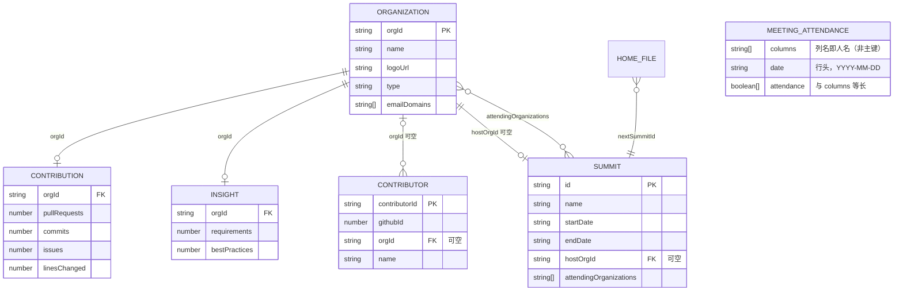

# 04 · 数据模型与接口契约

> 依赖文档：`02-frontend-design.md`、`03-backend-design.md`
> 定位：本文档是前后端协作的**唯一契约来源**。任何字段新增、改名、类型变更都必须先更新本文档。

---

## 1. 数据文件总览

| 文件 | 顶层结构 | 承载内容 | 记录量级 |
| --- | --- | --- | --- |
| `data/home.json` | `JsonFileEnvelope<HomeFileData>` | 首页四项指标 + 下一次峰会引用 | 1 |
| `data/organizations.json` | `JsonFileEnvelope<Organization[]>` | 组织档案（伙伴 / 外部开发者 / 社区） | 数十 |
| `data/contributions.json` | `JsonFileEnvelope<OrganizationContribution[]>` | GitHub 维度贡献 | 数十 |
| `data/insights.json` | `JsonFileEnvelope<OrganizationInsight[]>` | Confluence 维度贡献 | 数十 |
| `data/contributors.json` | `JsonFileEnvelope<Contributor[]>` | 个人贡献者档案（GitHub 账号维度） | 数百 |
| `data/summits.json` | `JsonFileEnvelope<SummitDetail[]>` | 峰会时间线与详情 | 十余 |
| `data/meetings.json` | `JsonFileEnvelope<MeetingAttendanceMatrix>` | 例会参会矩阵（人 × 日期） | 1 |

### 1.1 通用文件信封

所有数据文件统一结构，便于版本演进与校验：

```json
{
  "schemaVersion": 1,
  "updatedAt": "2026-09-18T09:00:00Z",
  "data": []
}
```

| 字段 | 类型 | 必填 | 说明 |
| --- | --- | --- | --- |
| `schemaVersion` | number | ✅ | 数据结构版本。结构发生不兼容变更时 +1，加载器据此决定是否兼容或拒绝 |
| `updatedAt` | string (ISO 8601, UTC) | ✅ | 该文件最后更新时间，用于前端展示"数据更新时间" |
| `data` | object \| array | ✅ | 实际业务数据，结构见第 3 节 |

### 1.2 数据关联关系



**关联规则**：

- `Organization.orgId` 是全局唯一主键，`contributions.json` / `insights.json` / `summits.attendingOrganizations` 均以它关联。
- `Contributor.orgId` **可空**：为空表示独立贡献者（不属于任何组织）。非空但档案缺失时，降级按独立贡献者处理并记 `WARN`。
- `Contributor.githubId`（GitHub 数字账号 ID）全局唯一，是阶段三采集归并与去重的稳定键。
- `Summit.hostOrgId` **可空**：有值时关联 `Organization.orgId`（主办组织，前端可跳转档案）；为空时前端以 `host` 文本兜底展示。
- 允许"有组织但无贡献记录"（新加入、暂未贡献）：此时接口返回该组织，指标补 `0`。
- 允许"有贡献记录但组织档案缺失"：`Service` 层以贡献记录内的 `orgName`/`logoUrl` 兜底，并记录 `WARN` 日志提示数据维护缺失。
- `attendingOrganizations` **存组织名称字符串**（便于人工维护可读性），`Service` 层负责按 `name`/`aliases` 反查 `orgId` 以便跳转。
- `MeetingAttendanceMatrix` **与任何实体都不关联**（独立实体，见 ADR-0005）：其 `columns` 是 Excel 台账表头**原文**（人名），**不是主键**，也不关联 `Organization` / `Contributor`，因此**不参与**组织归属判定与个人贡献统计口径。

---

## 2. 主键与命名规范

| 实体 | 主键 | 格式 | 示例 |
| --- | --- | --- | --- |
| 组织 | `orgId` | kebab-case，与 GitHub 组织名对齐（小写） | `openan-labs` |
| 贡献者 | `contributorId` | kebab-case，与 GitHub login 对齐（小写） | `octocat` |
| 峰会 | `id` | kebab-case + 年份 | `openan-summit-2026` |
| 例会参会矩阵 | **无主键** | 行 = 日期（`YYYY-MM-DD`），列 = 人名原文 | — |

**时间规范**：
- 所有时间字段均为 **ISO 8601 UTC** 字符串（带 `Z`），如 `"2026-09-18T09:00:00Z"`。
- 仅日期语义的字段（如峰会起止日）同样使用完整时间字符串，`00:00:00Z` 表示当天开始。
- **时区展示由前端负责**（本地化格式化），后端不做时区转换。

**命名规范**：
- JSON 与 API 字段统一 `camelCase`。
- 布尔字段 `is` / `has` 前缀。**唯一例外**：例会矩阵单元格 `present` 采用直陈式（`true` = 出席），因它是矩阵值而非实体属性。
- 数组字段使用复数名词（`tags`、`outcomes`）。
- 计数字段使用具体名词而非 `count` 后缀堆叠（`pullRequests`、`requirements`）。

---

## 3. 实体定义

### 3.1 `Organization`（组织档案）

| 字段 | 类型 | 必填 | 说明 |
| --- | --- | --- | --- |
| `orgId` | string | ✅ | 主键，kebab-case |
| `name` | string | ✅ | 展示名称 |
| `logoUrl` | string | ✅ | Logo 地址，对应 GitHub `avatar_url`；为空字符串时前端降级为首字母色块 |
| `homepageUrl` | string | ✅ | 主页地址，对应 GitHub `html_url` |
| `type` | `'partner' \| 'external' \| 'community' \| 'individual'` | ✅ | 组织类型：伙伴单位 / 外部开发者 / 社区组织 / **独立开发者**。`individual` 为**伪组织** `unattributed` 专用，不参与伙伴单位等组织计数 |
| `tags` | string[] | ✅ | 标签，如 `["伙伴单位", "芯片"]`；可为空数组 |
| `aliases` | Record<string, string> | ❌ | 多数据源别名映射，如 `{ "github": "OpenAN-Labs", "confluence": "OpenAN Labs" }`。**阶段三归并贡献数据的关键字段** |
| `emailDomains` | string[] | ❌ | 组织邮箱域名后缀清单（小写），用于按贡献者邮箱域名自动归属，如 `["huawei.com"]`。匹配规则见 3.2 归属判定。伪组织 `unattributed` 不配置 |
| `joinedAt` | string | ❌ | 加入社区时间，用于"新增伙伴"类统计 |
| `description` | string | ❌ | 一句话简介，用于组织卡片悬浮提示 |

### 3.2 `OrganizationContribution`（GitHub 维度贡献）

| 字段 | 类型 | 必填 | 说明 |
| --- | --- | --- | --- |
| `orgId` | string | ✅ | 关联 `Organization.orgId` |
| `orgName` | string | ✅ | 冗余展示名（档案缺失时兜底） |
| `logoUrl` | string | ✅ | 冗余 Logo |
| `homepageUrl` | string | ✅ | 冗余主页 |
| `github.pullRequests` | number | ✅ | **已合并** PR 数 |
| `github.commits` | number | ✅ | **合并 PR 内**的提交数（逐 PR 累加 `commits.totalCount`，口径见下方声明） |
| `github.issues` | number | ✅ | 提出或参与的 Issue 数 |
| `github.linesChanged` | number | ✅ | **PR 级** `additions + deletions` 汇总（口径见下方声明） |
| `github.repos` | number | ✅ | 参与仓库数 |
| `updatedAt` | string | ✅ | 该条记录更新时间 |

> **口径声明**（必须在前端 UI 上可查）：
> - `pullRequests` 仅统计**已合并**（merged）的 PR，不含 open / closed-unmerged。
> - `linesChanged` 采用 **PR 级汇总**：直接累加每个 PR 的 `additions + deletions`，**不对文件类型做任何过滤**（源码、文档、配置、二进制、生成代码一律计入）。理由：该值取自 PR 级字段，与 GitHub PR 页面显示的 `+N −M` 逐条一致、可直接对账；若做文件级过滤则须逐 PR 拉取 files 详情，配额与耗时不可接受。
> - `commits` 采用 **PR 级汇总**：逐条累加已合并 PR 的 `commits.totalCount`（PR 内提交总数），**不含未经 PR 直接推送到分支的提交**。理由：与 `pullRequests` / `linesChanged` 同源同一批已合并 PR，口径一致，且 `totalCount` 与 `additions` / `deletions` 在同一层嵌套查询获取，**不产生任何额外请求**；若统计仓库全部提交则须逐仓库翻页遍历提交历史，配额与耗时不可接受。
> - 统计范围限定为 OpenAN 组织下的仓库，且通过 `GITHUB_REPOS` 白名单可进一步收窄。
>
> **组织归属判定**（按优先级从高到低，结果写入 `contributors.json` 的 `orgId`）：
> 1. **登录名别名**：`Organization.aliases.github` 与贡献者 login（小写）精确匹配；
> 2. **邮箱域名**：贡献者邮箱域名命中 `Organization.emailDomains`（精确匹配优先，其次按 `.域名` 后缀匹配子域，如 `mail.huawei.com` 命中 `huawei.com`）。邮箱信号优先取 **PR 首个提交的作者邮箱**（`commits.nodes[0].commit.author.email`，企业邮箱的主要来源），缺失时退化为账户**公开资料邮箱**（`User.email`）；同一贡献者的全部记录（含其 Issue）共用同一邮箱信号；
> 3. **独立开发者**：以上均未命中 → 归入 `unattributed`。
>
> 归属判定补充说明：`@users.noreply.github.com` 等非组织域名自然不命中；邮箱**仅用于内存判定，不写入任何数据文件**；人工在 `contributors.json` 中已指定的 `orgId` **不会被自动判定覆盖**；多个组织配置相同域名时按 `organizations.json` 档案顺序先到先得并输出 `WARN` 提示修订。
>
> **未归属贡献（独立开发者）**：凡无法匹配到任何组织的贡献者，统一归入**伪组织** `orgId = "unattributed"`：
> - `organizations.json` 登记一条 `{ "orgId": "unattributed", "name": "独立开发者", "type": "individual", "logoUrl": "", "tags": ["独立开发者"] }`；
> - `contributions.json` 登记该伪组织的**聚合**贡献（所有未匹配贡献者之和）；
> - 首页卡片墙将其渲染为**独立开发者卡片**（中性色 + 个人图标）：人数取 `externalDeveloperCount`（= `contributors.json` 中 `orgId` 为空的条数），贡献量取其贡献记录；
> - 该伪组织**不计入**伙伴单位等组织计数，也不出现在 `type=partner/external/community` 的筛选结果中。

### 3.3 `OrganizationInsight`（Confluence 维度贡献）

| 字段 | 类型 | 必填 | 说明 |
| --- | --- | --- | --- |
| `orgId` | string | ✅ | 关联 `Organization.orgId` |
| `orgName` | string | ✅ | 冗余展示名 |
| `logoUrl` | string | ✅ | 冗余 Logo |
| `confluence.requirements` | number | ✅ | 在 Confluence 提交/承接的需求条数 |
| `confluence.bestPractices` | number | ✅ | best-practice 案例数 |
| `updatedAt` | string | ✅ | 该条记录更新时间 |

### 3.4 `HomeSummary`（首页概览）

| 字段 | 类型 | 必填 | 说明 |
| --- | --- | --- | --- |
| `partnerCount` | `MetricValue` | ✅ | 社区伙伴数量 |
| `externalDeveloperCount` | `MetricValue` | ✅ | 外部开发者数量 |
| `summitCount` | `MetricValue` | ✅ | 参加的峰会总数 |
| `useCaseCount` | `MetricValue` | ✅ | 已提供的应用案例数 |
| `nextSummit` | `SummitSummary \| null` | ✅ | 下一次峰会；无未来峰会时为 `null` |
| `updatedAt` | string | ✅ | 整体数据更新时间 |

`MetricValue` 结构：

| 字段 | 类型 | 必填 | 说明 |
| --- | --- | --- | --- |
| `value` | number | ✅ | 指标数值 |
| `unit` | string | ❌ | 单位，如 `"家"`、`"人"`、`"场"`、`"个"` |
| `delta` | number | ❌ | 环比变化量（正负均可） |
| `deltaDirection` | `'up' \| 'down' \| 'flat'` | ❌ | 变化方向，用于颜色与箭头。缺失时前端不展示角标 |

### 3.5 `SummitSummary` 与 `SummitDetail`

`SummitSummary`：

| 字段 | 类型 | 必填 | 说明 |
| --- | --- | --- | --- |
| `id` | string | ✅ | 主键 |
| `name` | string | ✅ | 峰会名称 |
| `startDate` | string | ✅ | 开始时间（ISO 8601） |
| `endDate` | string | ✅ | 结束时间（ISO 8601） |
| `location` | string | ✅ | 地点，格式 `城市 · 场馆` |
| `websiteUrl` | string | ✅ | 官网地址 |
| `isUpcoming` | boolean | ✅ | 是否未结束 |

`SummitDetail` 在 `SummitSummary` 基础上扩展：

| 字段 | 类型 | 必填 | 说明 |
| --- | --- | --- | --- |
| `description` | string | ✅ | 一句话峰会简介（时间线卡片副标题） |
| `hostOrgId` | string | ❌ | 主办组织，关联 `Organization.orgId`；有值时前端跳转组织档案 |
| `host` | string | ✅ | 主办方展示名；`hostOrgId` 缺失或无效时的兜底展示 |
| `attendeeCount` | number | ✅ | 参会人数 |
| `attendingOrganizations` | string[] | ✅ | 参会组织名称列表 |
| `agendaHighlights` | string[] | ✅ | 议程要点 |
| `outcomes` | string[] | ✅ | 峰会成果 |
| `minutesUrl` | string | ❌ | 峰会纪要链接；缺失时前端展示 `—` |

### 3.6 `HomeFileData`（`home.json` 的 `data` 结构）

`home.json` 只存指标数值与下一次峰会**引用**，不存峰会对象本体，避免数据双份维护：

| 字段 | 类型 | 必填 | 说明 |
| --- | --- | --- | --- |
| `partnerCount` | `MetricValue` | ✅ | 见 3.4 |
| `externalDeveloperCount` | `MetricValue` | ✅ | 见 3.4 |
| `summitCount` | `MetricValue` | ✅ | 见 3.4 |
| `useCaseCount` | `MetricValue` | ✅ | 见 3.4 |
| `nextSummitId` | string \| null | ✅ | 指向 `summits.json` 中的峰会 `id`；`Service` 据此组装 `nextSummit` |

> **`nextSummit` 的推导规则**：优先使用 `nextSummitId`；若未配置或指向的峰会已结束，则自动从 `summits.json` 中取 `endDate` 最晚且仍在未来的峰会。两者都无则返回 `null`。此规则在 `SummitService` 中实现，保证"下一次峰会"随数据更新自动纠正。

### 3.7 `Contributor`（个人贡献者）

以 **GitHub 账号**为维度的个人贡献者档案。部分贡献者隶属某个组织，部分为独立贡献者。

| 字段 | 类型 | 必填 | 说明 |
| --- | --- | --- | --- |
| `contributorId` | string | ✅ | 主键，kebab-case，与 GitHub login 小写对齐 |
| `githubId` | number | ✅ | GitHub 数字账号 ID（稳定不变），采集归并与去重的键 |
| `name` | string | ✅ | 展示名称；取 GitHub profile name，为空时前端回退展示 `contributorId` |
| `orgId` | string | ❌ | 关联 `Organization.orgId`；**为空表示独立贡献者**（不代表任何单位） |
| `avatarUrl` | string | ❌ | GitHub 头像；为空时前端降级为首字母色块 |
| `joinedAt` | string | ❌ | 首次参与社区贡献的时间，用于"新增贡献者"类统计 |
| `description` | string | ❌ | 一句话简介，用于卡片悬浮提示 |
| `github` | object | ❌ | GitHub 协作指标（`pullRequests`/`commits`/`issues`/`linesChanged`/`repos`，结构见 3.2）；**由采集器按轮回填**，人工维护的纯档案可能缺失该字段 |

> **定位说明**：本实体是「人工维护档案 + 采集回填指标」的混合实体。`joinedAt`、`description` 等字段由运营维护，`github` 指标由 GitHub 采集器以 `githubId` 归并个人 PR / Issue / 提交后写入（full 模式重算，增量模式在既有指标上叠加）。只读接口为 `GET /api/contributor-contributions`（见 5.3.8），**仅返回带 `github` 指标的个人**；`orgId` 为空的独立贡献者计入伪组织 `unattributed`，其人数同时写回 `home.json` 的 `externalDeveloperCount`。

### 3.8 `MeetingAttendanceMatrix`（例会参会矩阵）

> **独立实体**：与峰会、组织、贡献者**无任何关联**（ADR-0005）。定位是「把人 × 日期的二维台账**照搬**进 JSON」，**刻意不做规范化**。

| 字段 | 类型 | 必填 | 说明 |
| --- | --- | --- | --- |
| `columns` | string[] | ✅ | 列头，即人名**原文**（照搬 Excel 表头，保留原序与原文，含空格）。**非主键**，重名 / 改名 / 空格差异会产生重复列 |
| `rows` | `MeetingAttendanceRow[]` | ✅ | 每次例会一行，**保持 Excel 原序** |
| `updatedAt` | string | ❌ | 台账最后同步时间，由采集器写入 |

`MeetingAttendanceRow`：

| 字段 | 类型 | 必填 | 说明 |
| --- | --- | --- | --- |
| `date` | string | ✅ | 例会日期，`YYYY-MM-DD` |
| `attendance` | boolean[] | ✅ | 出席标记，**与 `columns` 等长、同序**；`true` = 出席，`false` = 缺席 |

> **口径声明**（必须在前端可查，见 02 §6.3）：
> - **空白 = 缺席**：台账中未标记的格子一律解析为 `false` 并计入出席率分母。因此**成员加入前的历史空白同样计入缺席**，会系统性拉低后加入者的出席率——这是 ADR-0005 明知并接受的负债。
> - **不含会议元信息**：无时长、主持人、议程、地点等字段（ADR-0005 明确放弃）。
> - **不含聚合字段**：个人出席率（`present / rows.length`）与每场出席人数均由**前端**派生，接口不返回。

---

## 4. 数据文件样例

以下样例即为**本阶段的硬编码数据源**，实现时直接以此结构创建文件。所有样例数据均为示意值，可在维护时替换。

### 4.1 `data/home.json`

```json
{
  "schemaVersion": 1,
  "updatedAt": "2026-09-18T09:00:00Z",
  "data": {
    "partnerCount": { "value": 28, "unit": "家", "delta": 3, "deltaDirection": "up" },
    "externalDeveloperCount": { "value": 412, "unit": "人", "delta": 26, "deltaDirection": "up" },
    "summitCount": { "value": 17, "unit": "场", "delta": 1, "deltaDirection": "up" },
    "useCaseCount": { "value": 63, "unit": "个", "delta": 5, "deltaDirection": "up" },
    "nextSummitId": "openan-summit-2026"
  }
}
```

### 4.2 `data/organizations.json`

```json
{
  "schemaVersion": 1,
  "updatedAt": "2026-09-18T09:00:00Z",
  "data": [
    {
      "orgId": "openan-labs",
      "name": "OpenAN Labs",
      "logoUrl": "https://avatars.githubusercontent.com/u/0000001?v=4",
      "homepageUrl": "https://github.com/openan-labs",
      "type": "community",
      "tags": ["社区组织", "核心维护"],
      "aliases": { "github": "openan-labs", "confluence": "OpenAN Labs" },
      "emailDomains": ["openan.dev"],
      "joinedAt": "2023-03-01T00:00:00Z",
      "description": "OpenAN 社区发起方与核心仓库维护者。"
    },
    {
      "orgId": "nova-silicon",
      "name": "NovaSilicon",
      "logoUrl": "https://avatars.githubusercontent.com/u/0000002?v=4",
      "homepageUrl": "https://github.com/nova-silicon",
      "type": "partner",
      "tags": ["伙伴单位", "芯片", "驱动"],
      "aliases": { "github": "nova-silicon", "confluence": "NovaSilicon 技术团队" },
      "emailDomains": ["novasilicon.com"],
      "joinedAt": "2023-06-15T00:00:00Z",
      "description": "提供 NPU 驱动与算子库适配，主导异构算力接入方案。"
    },
    {
      "orgId": "harbor-cloud",
      "name": "HarborCloud",
      "logoUrl": "https://avatars.githubusercontent.com/u/0000003?v=4",
      "homepageUrl": "https://github.com/harbor-cloud",
      "type": "partner",
      "tags": ["伙伴单位", "云原生", "调度"],
      "aliases": { "github": "harbor-cloud", "confluence": "HarborCloud 云原生组" },
      "emailDomains": ["harborcloud.io"],
      "joinedAt": "2024-01-20T00:00:00Z",
      "description": "参与编排引擎与资源调度模块共建，贡献多集群部署实践。"
    },
    {
      "orgId": "lumen-dev",
      "name": "Lumen Dev",
      "logoUrl": "https://avatars.githubusercontent.com/u/0000004?v=4",
      "homepageUrl": "https://github.com/lumen-dev",
      "type": "external",
      "tags": ["外部开发者", "文档"],
      "aliases": { "github": "lumen-dev", "confluence": "Lumen" },
      "emailDomains": ["lumen.dev"],
      "description": "独立开发者，长期贡献中文文档与快速上手指南。"
    },
    {
      "orgId": "unattributed",
      "name": "独立开发者",
      "logoUrl": "",
      "homepageUrl": "",
      "type": "individual",
      "tags": ["独立开发者"],
      "description": "未归属到任何组织的独立贡献者聚合（伪组织）。"
    }
  ]
}
```

### 4.3 `data/contributions.json`

```json
{
  "schemaVersion": 1,
  "updatedAt": "2026-09-18T09:00:00Z",
  "data": [
    {
      "orgId": "openan-labs",
      "orgName": "OpenAN Labs",
      "logoUrl": "https://avatars.githubusercontent.com/u/0000001?v=4",
      "homepageUrl": "https://github.com/openan-labs",
      "github": { "pullRequests": 486, "commits": 1420, "issues": 212, "linesChanged": 318420, "repos": 24 },
      "updatedAt": "2026-09-18T09:00:00Z"
    },
    {
      "orgId": "nova-silicon",
      "orgName": "NovaSilicon",
      "logoUrl": "https://avatars.githubusercontent.com/u/0000002?v=4",
      "homepageUrl": "https://github.com/nova-silicon",
      "github": { "pullRequests": 173, "commits": 512, "issues": 68, "linesChanged": 142880, "repos": 9 },
      "updatedAt": "2026-09-18T09:00:00Z"
    },
    {
      "orgId": "harbor-cloud",
      "orgName": "HarborCloud",
      "logoUrl": "https://avatars.githubusercontent.com/u/0000003?v=4",
      "homepageUrl": "https://github.com/harbor-cloud",
      "github": { "pullRequests": 121, "commits": 348, "issues": 54, "linesChanged": 96540, "repos": 7 },
      "updatedAt": "2026-09-18T09:00:00Z"
    },
    {
      "orgId": "lumen-dev",
      "orgName": "Lumen Dev",
      "logoUrl": "https://avatars.githubusercontent.com/u/0000004?v=4",
      "homepageUrl": "https://github.com/lumen-dev",
      "github": { "pullRequests": 37, "commits": 96, "issues": 19, "linesChanged": 21460, "repos": 3 },
      "updatedAt": "2026-09-18T09:00:00Z"
    },
    {
      "orgId": "unattributed",
      "orgName": "独立开发者",
      "logoUrl": "",
      "homepageUrl": "",
      "github": { "pullRequests": 15, "commits": 28, "issues": 9, "linesChanged": 6800, "repos": 3 },
      "updatedAt": "2026-09-18T09:00:00Z"
    }
  ]
}
```

### 4.4 `data/insights.json`

```json
{
  "schemaVersion": 1,
  "updatedAt": "2026-09-18T09:00:00Z",
  "data": [
    {
      "orgId": "openan-labs",
      "orgName": "OpenAN Labs",
      "logoUrl": "https://avatars.githubusercontent.com/u/0000001?v=4",
      "confluence": { "requirements": 42, "bestPractices": 18 },
      "updatedAt": "2026-09-18T09:00:00Z"
    },
    {
      "orgId": "nova-silicon",
      "orgName": "NovaSilicon",
      "logoUrl": "https://avatars.githubusercontent.com/u/0000002?v=4",
      "confluence": { "requirements": 26, "bestPractices": 11 },
      "updatedAt": "2026-09-18T09:00:00Z"
    },
    {
      "orgId": "harbor-cloud",
      "orgName": "HarborCloud",
      "logoUrl": "https://avatars.githubusercontent.com/u/0000003?v=4",
      "confluence": { "requirements": 17, "bestPractices": 7 },
      "updatedAt": "2026-09-18T09:00:00Z"
    },
    {
      "orgId": "lumen-dev",
      "orgName": "Lumen Dev",
      "logoUrl": "https://avatars.githubusercontent.com/u/0000004?v=4",
      "confluence": { "requirements": 4, "bestPractices": 3 },
      "updatedAt": "2026-09-18T09:00:00Z"
    }
  ]
}
```

### 4.5 `data/contributors.json`

```json
{
  "schemaVersion": 1,
  "updatedAt": "2026-09-18T09:00:00Z",
  "data": [
    {
      "contributorId": "lin-chen",
      "githubId": 100200301,
      "name": "Lin Chen",
      "orgId": "nova-silicon",
      "avatarUrl": "https://avatars.githubusercontent.com/u/100200301?v=4",
      "joinedAt": "2023-08-02T00:00:00Z",
      "description": "NPU 驱动核心贡献者",
      "github": {
        "pullRequests": 18,
        "commits": 96,
        "issues": 7,
        "linesChanged": 24310,
        "repos": 4
      }
    },
    {
      "contributorId": "aria-dev",
      "githubId": 100200302,
      "name": "Aria",
      "orgId": null,
      "avatarUrl": "https://avatars.githubusercontent.com/u/100200302?v=4",
      "joinedAt": "2024-03-11T00:00:00Z",
      "description": "独立开发者，专注中文文档翻译"
    },
    {
      "contributorId": "kai-zhou",
      "githubId": 100200303,
      "name": "Kai Zhou",
      "orgId": "harbor-cloud",
      "avatarUrl": "https://avatars.githubusercontent.com/u/100200303?v=4",
      "joinedAt": "2024-06-20T00:00:00Z",
      "description": "多集群调度实践布道者"
    },
    {
      "contributorId": "solo-hacker",
      "githubId": 100200304,
      "name": "",
      "orgId": null,
      "avatarUrl": "",
      "joinedAt": "2025-01-15T00:00:00Z",
      "description": "独立贡献者，name/avatarUrl 缺失时前端降级展示"
    }
  ]
}
```

### 4.6 `data/summits.json`

```json
{
  "schemaVersion": 1,
  "updatedAt": "2026-09-18T09:00:00Z",
  "data": [
    {
      "id": "openan-summit-2026",
      "name": "OpenAN Summit 2026",
      "startDate": "2026-11-12T00:00:00Z",
      "endDate": "2026-11-14T00:00:00Z",
      "location": "上海 · 世博中心",
      "websiteUrl": "https://openan.example.org/summit/2026",
      "isUpcoming": true,
      "description": "OpenAN 社区年度旗舰峰会，发布年度技术路线图与共建成果。",
      "hostOrgId": null,
      "host": "OpenAN 社区委员会",
      "attendeeCount": 640,
      "attendingOrganizations": [
        "OpenAN Labs", "NovaSilicon", "HarborCloud", "Lumen Dev", "Ferro Systems", "Atlas Compute"
      ],
      "agendaHighlights": [
        "异构算力统一接入方案年度进展",
        "编排引擎 2.0 架构发布",
        "社区治理与 SIG 运作机制升级"
      ],
      "outcomes": [
        "发布编排引擎 2.0 路线图",
        "新增 6 家伙伴单位签署共建协议"
      ],
      "minutesUrl": "https://openan.example.org/summit/2026/minutes"
    },
    {
      "id": "openan-hackathon-2025",
      "name": "OpenAN Developer Hackathon 2025",
      "startDate": "2025-08-22T00:00:00Z",
      "endDate": "2025-08-24T00:00:00Z",
      "location": "深圳 · 南山科技园",
      "websiteUrl": "https://openan.example.org/hackathon/2025",
      "isUpcoming": false,
      "description": "面向开发者的 48 小时极限创作马拉松，聚焦 NPU 与调度实战。",
      "hostOrgId": "openan-labs",
      "host": "OpenAN Labs",
      "attendeeCount": 218,
      "attendingOrganizations": ["OpenAN Labs", "NovaSilicon", "HarborCloud", "Lumen Dev"],
      "agendaHighlights": [
        "NPU DRA 插件实战工作坊",
        "社区贡献者闪电演讲",
        "48 小时应用案例开发赛"
      ],
      "outcomes": [
        "产出 23 个可运行的应用案例原型",
        "12 名外部开发者成为常驻贡献者"
      ],
      "minutesUrl": "https://openan.example.org/hackathon/2025/minutes"
    },
    {
      "id": "openan-plenary-2024",
      "name": "OpenAN 社区全体峰会 2024",
      "startDate": "2024-05-16T00:00:00Z",
      "endDate": "2024-05-17T00:00:00Z",
      "location": "北京 · 国家峰会中心",
      "websiteUrl": "https://openan.example.org/plenary/2024",
      "isUpcoming": false,
      "description": "社区全体峰会，审议年度工作报告并表决 SIG 成立动议。",
      "hostOrgId": null,
      "host": "OpenAN 社区委员会",
      "attendeeCount": 386,
      "attendingOrganizations": ["OpenAN Labs", "NovaSilicon", "HarborCloud"],
      "agendaHighlights": [
        "社区年度工作报告",
        "伙伴单位共建成果汇报",
        "基础设施 SIG 成立动议"
      ],
      "outcomes": ["正式成立基础设施与调度两个 SIG"],
      "minutesUrl": "https://openan.example.org/plenary/2024/minutes"
    }
  ]
}
```

### 4.7 `data/meetings.json`

```json
{
  "schemaVersion": 1,
  "updatedAt": "2026-09-18T09:00:00Z",
  "data": {
    "columns": ["张三", "李四", "王五", "赵六"],
    "rows": [
      { "date": "2026-09-18", "attendance": [true, true, true, false] },
      { "date": "2026-09-11", "attendance": [true, false, true, true] },
      { "date": "2026-09-04", "attendance": [true, true, false, true] }
    ],
    "updatedAt": "2026-09-18T09:00:00Z"
  }
}
```

> 说明：`columns` 取自台账表头原文；新增成员追加在**末尾**，离场成员**保留列**（历史出席不可抹除）；`rows` 按台账原序排列，接口不做重排（ADR-0005）。本文件由 `apps/api/scripts/import-meetings.ts` 从 `data/source/meetings.xlsx` 生成，日常只维护 Excel（见 05 文档第 10 节）。

---

## 5. REST 接口契约

### 5.1 通用约定

| 项 | 约定 |
| --- | --- |
| 基地址 | 同域部署为 `/api`；开发期由 Vite 代理 `/api` → `http://localhost:3000` |
| 版本策略 | 路径中暂不带版本号。发生不兼容变更时改为 `/api/v2/...`，旧路径保留一个迭代周期 |
| 请求方法 | 本阶段全部为 `GET`（只读看板），无写接口 |
| 内容类型 | 响应 `application/json; charset=utf-8` |
| 响应信封 | 统一 `{ code, message, data }`，`code = 0` 表示成功 |
| 时间格式 | 请求与响应中的时间均为 ISO 8601 UTC 字符串 |
| 分页 | 仅 `GET /api/summits` 预留分页参数，其余接口数据量小、一次性返回 |
| 排序 | 由后端给出业务默认排序（见各接口说明），前端可再对已获取数据做本地排序 |
| 未知参数 | 返回 `40001`（`forbidNonWhitelisted`），避免拼写错误被静默忽略 |
| 缓存头 | 响应包含 `Cache-Control: private, max-age=60`；数据陈旧时附加 `X-Data-Stale: true` |
| 幂等性 | 全部 `GET`，天然幂等，前端可安全重试 |

### 5.2 接口清单

| # | 方法 | 路径 | 用途 | 主要使用页面 |
| --- | --- | --- | --- | --- |
| 1 | GET | `/api/home/summary` | 首页概览（四项指标 + 下一次峰会） | 首页 |
| 2 | GET | `/api/organizations` | 组织档案列表 | 首页（贡献组织）、社区活跃度（筛选） |
| 3 | GET | `/api/contributions` | 组织 GitHub 维度贡献 | 社区活跃度（明细表 / 排行榜 / 组织贡献分布环形图） |
| 4 | GET | `/api/insights` | 组织 Confluence 维度贡献 | 社区活跃度 |
| 5 | GET | `/api/contributions/summary` | 贡献聚合总量 | 社区活跃度（页头更新时间等） |
| 6 | GET | `/api/summits` | 峰会列表（可含详情） | 社区参展 |
| 7 | GET | `/api/summits/:id` | 单场峰会详情 | 社区参展（预留跳转） |
| 8 | GET | `/api/contributor-contributions` | 个人 GitHub 维度贡献 | 社区活跃度（个人贡献排行） |
| 9 | GET | `/api/meetings` | 例会参会矩阵（人 × 日期） | 例会参会情况 |

### 5.3 接口详细定义

#### 5.3.1 `GET /api/home/summary`

**用途**：首页一次性获取全部概览数据。

**请求参数**：无。

**响应 `data`**：`HomeSummary`（见 3.4），其中 `nextSummit` 为 `SummitSummary`：

```json
{
  "code": 0,
  "message": "ok",
  "data": {
    "partnerCount": { "value": 28, "unit": "家", "delta": 3, "deltaDirection": "up" },
    "externalDeveloperCount": { "value": 412, "unit": "人", "delta": 26, "deltaDirection": "up" },
    "summitCount": { "value": 17, "unit": "场", "delta": 1, "deltaDirection": "up" },
    "useCaseCount": { "value": 63, "unit": "个", "delta": 5, "deltaDirection": "up" },
    "nextSummit": {
      "id": "openan-summit-2026",
      "name": "OpenAN Summit 2026",
      "startDate": "2026-11-12T00:00:00Z",
      "endDate": "2026-11-14T00:00:00Z",
      "location": "上海 · 世博中心",
      "websiteUrl": "https://openan.example.org/summit/2026",
      "isUpcoming": true
    },
    "updatedAt": "2026-09-18T09:00:00Z"
  }
}
```

**失败场景**：`50001`（`home.json` 结构损坏）。

---

#### 5.3.2 `GET /api/organizations`

**用途**：获取组织档案。首页用于渲染"贡献的组织"卡片墙（**全量组织**，按综合贡献分降序，见 ADR-0001）；社区活跃度页用于组织筛选下拉。

**请求参数**：

| 参数 | 类型 | 必填 | 默认 | 说明 |
| --- | --- | --- | --- | --- |
| `scope` | `'all' \| 'contributing'` | 否 | `all` | `contributing`：返回**全部**组织并附带 `contributionScore` / `contributionLevel`，按综合贡献分降序（首页使用；**不过滤**零贡献组织，见 ADR-0001） |
| `type` | `'partner' \| 'external' \| 'community' \| 'individual'` | 否 | — | 按组织类型过滤 |
| `keyword` | string | 否 | — | 按 `name` 模糊匹配，大小写不敏感 |

**响应 `data`**：`Organization[]`；`scope=contributing` 时为 `OrganizationCard[]`，每项额外附带以下派生字段（仅接口层计算，不落盘）：

| 字段 | 类型 | 说明 |
| --- | --- | --- |
| `contributionScore` | number | 综合贡献分：`(PR + Issue + 需求 + best-practice) + 代码量(行) / 10000`，四舍五入取整；无贡献记录的组织为 `0` |
| `contributionLevel` | `'high' \| 'medium' \| 'low'` | `≥300` → high，`≥100` → medium，其余 → low；**0 分同样返回 low**，由前端以「暂无贡献」样式呈现（见 ADR-0001） |

```json
{
  "code": 0,
  "message": "ok",
  "data": [
    {
      "orgId": "nova-silicon",
      "name": "NovaSilicon",
      "logoUrl": "https://avatars.githubusercontent.com/u/0000002?v=4",
      "homepageUrl": "https://github.com/nova-silicon",
      "type": "partner",
      "tags": ["伙伴单位", "芯片", "驱动"],
      "aliases": { "github": "nova-silicon", "confluence": "NovaSilicon 技术团队" },
      "emailDomains": ["novasilicon.com"],
      "joinedAt": "2023-06-15T00:00:00Z",
      "description": "提供 NPU 驱动与算子库适配，主导异构算力接入方案。",
      "contributionScore": 87,
      "contributionLevel": "medium"
    }
  ]
}
```

**排序**：默认（`scope=all`）按 `type` 权重（`community` → `partner` → `external` → `individual`），同权重按 `name` 升序；`scope=contributing` 按 `contributionScore` 降序，同分（含 0 分）保持默认顺序（稳定排序，零分组织自然居于末尾）。

---

#### 5.3.3 `GET /api/contributions`

**用途**：社区活跃度页的贡献排行榜与明细表数据源（GitHub 维度）。

**请求参数**：

| 参数 | 类型 | 必填 | 默认 | 说明 |
| --- | --- | --- | --- | --- |
| `orgIds` | string（逗号分隔） | 否 | — | 组织 ID 白名单，如 `openan-labs,nova-silicon` |
| `from` | string (ISO 8601) | 否 | — | 统计起始时间 |
| `to` | string (ISO 8601) | 否 | — | 统计结束时间 |
| `sortBy` | `'pullRequests' \| 'commits' \| 'issues' \| 'linesChanged' \| 'repos'` | 否 | `pullRequests` | 排序字段 |
| `order` | `'asc' \| 'desc'` | 否 | `desc` | 排序方向 |
| `limit` | number | 否 | — | 仅返回前 N 条，用于排行榜 Top N；不传返回全部 |

**响应 `data`**：`OrganizationContribution[]`，字段见 3.2。

```json
{
  "code": 0,
  "message": "ok",
  "data": [
    {
      "orgId": "openan-labs",
      "orgName": "OpenAN Labs",
      "logoUrl": "https://avatars.githubusercontent.com/u/0000001?v=4",
      "homepageUrl": "https://github.com/openan-labs",
      "github": { "pullRequests": 486, "commits": 1420, "issues": 212, "linesChanged": 318420, "repos": 24 },
      "updatedAt": "2026-09-18T09:00:00Z"
    }
  ]
}
```

**校验规则**：`from` 晚于 `to` → `40002`；`orgIds` 含未知 ID 时**忽略该项并继续**（记 `WARN`），不整体报错。

> **阶段三行为变化预告**：`from`/`to` 在阶段一**不生效**（本地数据无时间维度明细），接口接受参数但返回全量，并在 `message` 中保持 `"ok"`。阶段三接入采集后，区间口径由**采集器**在落盘时决定（增量以 `lastSyncAt` 游标为起点，见 05 文档 2.4 节）；接口依旧只读落盘结果，行为与阶段一保持一致。前端无需改动。

---

#### 5.3.4 `GET /api/insights`

**用途**：社区活跃度页的 Confluence 维度数据。

**请求参数**：与 `/api/contributions` 相同（`sortBy` 可选值为 `requirements` / `bestPractices`）。

**响应 `data`**：`OrganizationInsight[]`，字段见 3.3。

---

#### 5.3.5 `GET /api/contributions/summary`

**用途**：社区活跃度页的聚合总量与数据更新时间（页头展示）。组织贡献分布环形图已改为复用 `GET /api/contributions` 按提交数统计（ADR-0003），不再依赖本接口。

**请求参数**：`orgIds`、`from`、`to`（语义同上）。

**响应 `data`**：

| 字段 | 类型 | 说明 |
| --- | --- | --- |
| `totals` | object | 各类指标总量 |
| `totals.pullRequests` | number | PR 总数 |
| `totals.commits` | number | 合并 PR 内提交总数 |
| `totals.issues` | number | Issue 总数 |
| `totals.linesChanged` | number | 代码量总数 |
| `totals.requirements` | number | 需求总数 |
| `totals.bestPractices` | number | best-practice 案例总数 |
| `orgCount` | number | 参与统计的组织数 |
| `updatedAt` | string | 数据更新时间 |

```json
{
  "code": 0,
  "message": "ok",
  "data": {
    "totals": {
      "pullRequests": 817,
      "issues": 353,
      "linesChanged": 579300,
      "requirements": 89,
      "bestPractices": 39
    },
    "orgCount": 4,
    "updatedAt": "2026-09-18T09:00:00Z"
  }
}
```

> **口径**：环形图自 ADR-0003 起按**组织提交数**（`github.commits`）统计，占比低于 3% 的组织并入「其他」，数据复用 `GET /api/contributions`；本接口的 `totals` 仅作聚合参考，`linesChanged` 单独在排行榜中展示。

---

#### 5.3.6 `GET /api/summits`

**用途**：社区参展页的时间线数据；`includeDetail=true` 时一并返回详情表格数据。

**请求参数**：

| 参数 | 类型 | 必填 | 默认 | 说明 |
| --- | --- | --- | --- | --- |
| `year` | number | 否 | — | 按开始年份过滤，范围 2000–2100，越界 → `40003` |
| `includeDetail` | boolean（字符串 `'true'`/`'false'`） | 否 | `false` | 是否返回 `SummitDetail` 完整字段 |
| `upcomingOnly` | boolean | 否 | `false` | 仅返回未结束的峰会（首页底部横幅可用） |
| `page` | number | 否 | `1` | 页码，最小 1 |
| `pageSize` | number | 否 | `20` | 每页数量，最大 100 |

**响应 `data`**：

- `includeDetail=false` → `{ items: SummitSummary[], total, page, pageSize }`
- `includeDetail=true` → `{ items: SummitDetail[], total, page, pageSize }`

```json
{
  "code": 0,
  "message": "ok",
  "data": {
    "items": [
      {
        "id": "openan-summit-2026",
        "name": "OpenAN Summit 2026",
        "startDate": "2026-11-12T00:00:00Z",
        "endDate": "2026-11-14T00:00:00Z",
        "location": "上海 · 世博中心",
        "websiteUrl": "https://openan.example.org/summit/2026",
        "isUpcoming": true,
        "description": "OpenAN 社区年度旗舰峰会，发布年度技术路线图与共建成果。",
        "hostOrgId": null,
        "host": "OpenAN 社区委员会",
        "attendeeCount": 640,
        "attendingOrganizations": ["OpenAN Labs", "NovaSilicon", "HarborCloud"],
        "agendaHighlights": ["异构算力统一接入方案年度进展"],
        "outcomes": ["发布编排引擎 2.0 路线图"],
        "minutesUrl": "https://openan.example.org/summit/2026/minutes"
      }
    ],
    "total": 3,
    "page": 1,
    "pageSize": 20
  }
}
```

**默认排序**：`startDate` **降序**（最近的峰会在最上），符合"时间线回顾"的阅读习惯。前端按年份分组渲染。

---

#### 5.3.7 `GET /api/summits/:id`

**用途**：单场峰会详情（本期由前端锚点跳转实现，此接口为后续独立详情页预留）。

**路径参数**：`id`（峰会主键）。

**响应 `data`**：`SummitDetail`。

**失败场景**：`40402`（峰会不存在）。

---

#### 5.3.8 `GET /api/contributor-contributions`

**用途**：社区活跃度页「个人贡献排行」卡（见 02 §4.1 与 ADR-0004）。按**个人维度**返回 GitHub 协作指标，回答「社区里谁投入最多」，与组织维度接口（5.3.3）互补。

**请求参数**：

| 参数 | 类型 | 必填 | 默认 | 说明 |
| --- | --- | --- | --- | --- |
| `orgIds` | string | 否 | — | 组织筛选，逗号分隔（语义同 5.3.3）；`orgId` 为空的独立贡献者按伪组织 `unattributed` 匹配 |
| `from` | ISO 8601 | 否 | — | 起始时间；**阶段一接受但不生效**（见下方口径） |
| `to` | ISO 8601 | 否 | — | 结束时间；同上 |
| `sortBy` | string | 否 | `commits` | 可选 `pullRequests` / `commits` / `issues` / `linesChanged` / `repos` |
| `order` | string | 否 | `desc` | `asc` / `desc` |
| `limit` | number | 否 | — | 1–200；不传返回全部 |

**响应 `data`**：`ContributorContribution[]`——即 `Contributor`（字段见 3.7）**且 `github` 恒有值**。仅返回采集到贡献记录的个人，人工维护但本轮无贡献记录的档案不会出现在结果中。

```json
{
  "code": 0,
  "message": "ok",
  "data": [
    {
      "contributorId": "zhoujie628",
      "githubId": 1234567,
      "name": "Jie Zhou",
      "orgId": "huawei",
      "avatarUrl": "https://avatars.githubusercontent.com/u/1234567?v=4",
      "github": {
        "pullRequests": 127,
        "commits": 548,
        "issues": 78,
        "linesChanged": 198930,
        "repos": 7
      }
    }
  ]
}
```

**默认排序**：按 `sortBy`（默认 `commits`）**降序**，排序在服务端完成；前端在返回数据上按所选指标二次排序并取 Top 8（总量为数十条，不传接口 `limit`，避免与页面筛选参数形成第二套口径）。

> **口径说明**：
>
> - 个人指标与组织指标（5.3.3）由**同一轮采集的同批记录**聚合而来，两者合计恒等（个人之和 = 组织之和，含伪组织 `unattributed` 行），可互相核对；
> - `orgIds` 命中规则：`orgId` 为空的独立贡献者按伪组织 `unattributed` 参与筛选，因此可以单独查看该人群；
> - `from` / `to` 在阶段一接受但不生效（采集侧暂未按时间切片个人记录），前端在卡片底部给出同期口径提示；
> - 仅使用 GitHub 公开数据（`name` / `avatarUrl` / 协作计数），邮箱等身份信息只用于内存中的组织归属判定，**不落盘**。

#### 5.3.9 `GET /api/meetings`

**用途**：例会参会情况页（`/meetings`）的矩阵数据，**透传** `data/meetings.json`（ADR-0005）。

**请求参数**：无。

**响应 `data`**：`MeetingAttendanceMatrix`（见 3.8），**原样返回**——不排序、不聚合、不补全：

```json
{
  "code": 0,
  "message": "ok",
  "data": {
    "columns": ["张三", "李四", "王五", "赵六"],
    "rows": [
      { "date": "2026-09-18", "attendance": [true, true, true, false] },
      { "date": "2026-09-11", "attendance": [true, false, true, true] },
      { "date": "2026-09-04", "attendance": [true, true, false, true] }
    ],
    "updatedAt": "2026-09-18T09:00:00Z"
  }
}
```

**排序**：**不排序**——严格保持 `meetings.json` 中 `columns` 与 `rows` 的原序（ADR-0005）。这是对 5.1 通用约定「前端可再对已获取数据做本地排序」的**明确例外**：本接口返回的矩阵**禁止前端重排**。

**校验规则**：`attendance.length !== columns.length`，或 `date` 不匹配 `YYYY-MM-DD` → `50001`（数据文件结构损坏，语义同 5.3.1）。该校验由采集器在落盘前保证，接口层仅做防御性检查。

**失败场景**：`50001`（`meetings.json` 缺失或结构损坏）。

---

## 6. 契约治理

### 6.1 变更流程

1. 先在本文档修改字段定义与接口描述；
2. 同步更新 `apps/api` 中的 DTO/端口接口与 `apps/web` 中的 `types/`；
3. 更新 `data/*.json` 种子数据（如需）；
4. 若为不兼容变更，提升对应文件的 `schemaVersion` 并在本目录追加变更记录。

### 6.2 字段语义速查（供 Code Review）

| 字段 | 不等于 | 正确语义 |
| --- | --- | --- |
| `github.pullRequests` | 所有 PR | **已合并**的 PR |
| `github.linesChanged` | 净增行数 / 文件级过滤后的行数 | **PR 级** `additions + deletions` 累加，含全部文件类型 |
| `github.issues` | 仅 opened | 提出或参与（含评论/被指派）的 Issue |
| `type = 'external'` | 非社区成员 | 独立外部开发者（非单位身份） |
| `type = 'individual'` | 一个真人 / 一家组织 | **伪组织** `unattributed` 专用类型，代表「未归属的独立开发者聚合」 |
| `isUpcoming` | 未开始 | **未结束**（进行中的峰会同样为 `true`） |
| `MeetingAttendanceMatrix.columns` | 主键 / 稳定标识 | 台账表头**原文**（人名），非主键，靠台账人工保持一致 |
| `attendance[i] = false` | 该人明确请假 | **未出席**（含「尚未加入」的历史空白），且计入出席率分母 |

### 6.3 契约自检清单

- [ ] 四个页面的每个展示字段，都能在本文档中找到对应定义
- [ ] `data/*.json` 中不存在本文档未定义的字段
- [ ] 所有必填字段在种子数据中均已提供
- [ ] 可选字段在前端均有降级展示策略
- [ ] API 响应信封结构全部一致，无裸返回
- [ ] 错误码全部取自第 7 节错误码表，无临时硬编码数字

