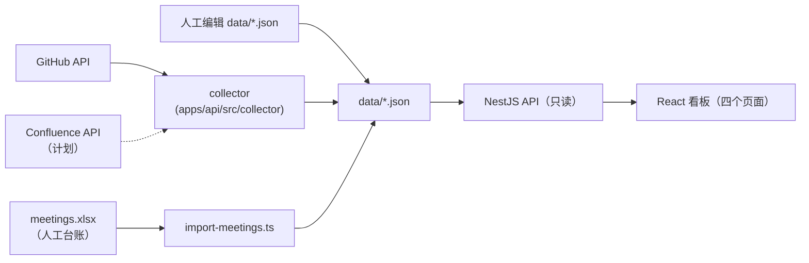

# 08 · 数据采集目录（Data Catalog）

> 依赖文档：`04-data-and-api-contract.md`、`05-integration-roadmap.md`
> 定位：**从数据视角**登记本看板（数据集成看板）所采集 / 展示的每一项数据——从哪来、怎么采、怎么归类、是否已实现、未实现还缺什么。
> **本文件可自由编辑**：它是登记册（registry），**不定义契约**；字段与接口的权威定义以 `04` 为唯一来源。发现不一致时直接修订本文件，或按 `04 §6.1` 发起契约变更。

## 0. 使用说明

**状态**：✅ 已实现（`data/*.json` 有真实数据且链路可跑通）｜🟡 计划中（接口/模型已预留，无采集器或数据为空）｜➖ 派生（无独立采集，由其它数据计算）

**采集方式**：人工维护（运营编辑 JSON/Excel）｜采集脚本（脚本从文件/API 生成 JSON）｜外部 API（GitHub/Confluence/Zoom）｜派生（无采集动作）

**排序约定**：§1 汇总按 **页面 → 页面内数据（自上而下）→ 平台横切** 排列，§2 详细描述沿用同一编号。

## 1. 汇总（一句话速览）

### 1.1 首页 `/`

| 编号 | 数据 | 一句话描述 | 状态 | 采集方式 |
| --- | --- | --- | --- | --- |
| H1 | 伙伴单位数 `partnerCount` | 与社区签署共建协议的组织数（`type=partner`） | ✅ | 人工维护（目标自动聚合） |
| H2 | 外部开发者数 `externalDeveloperCount` | 参与过贡献、未归属任何组织的独立开发者人数 | ✅ | 外部 API 回填 |
| H3 | 社区峰会场次 `summitCount` | 峰会与全体峰会的累计场次 | ✅ | 人工维护（目标聚合 `summits.json`） |
| H4 | 应用案例数 `useCaseCount` | 社区沉淀并通过评审的可运行案例数 | ✅ | 人工维护（**缺底层清单**） |
| H5 | 下一次峰会 `nextSummit` | 尚未结束、`endDate` 最晚的一场峰会 | ➖ | 派生（`home.nextSummitId` → `summits.json`） |
| H6 | 贡献组织卡片墙 | 全量组织按综合贡献分降序展示，零分显示「暂无贡献」 | ➖ | 派生（组织档案 + GitHub/Confluence 贡献） |

### 1.2 社区活跃度 `/activity`

| 编号 | 数据 | 一句话描述 | 状态 | 采集方式 |
| --- | --- | --- | --- | --- |
| A1 | 组织 GitHub 贡献明细 | 各组织的已合并 PR、PR 内提交、Issue、代码量与参与仓库数 | ✅ | 外部 API（GitHub GraphQL） |
| A2 | 个人贡献排行 | 以 GitHub 账号为维度、带协作指标的个人贡献者（含独立开发者） | ✅ | 外部 API 回填 |
| A3 | Confluence 成果（需求 / best-practice） | 各组织在 Confluence 登记的需求数与最佳实践案例数 | 🟡 | 外部 API（Confluence CQL） |
| A4 | 组织贡献分布（环形图） | 按组织提交数（`github.commits`）计算的占比，低于 3% 并入「其他」 | ➖ | 派生（复用 A1） |
| A5 | 贡献聚合总量 | 各指标总量与数据更新时间（页头展示） | ➖ | 派生（A1 + A3） |
| A6 | 时间区间筛选 | `from` / `to` 区间过滤，阶段一接收但不生效 | 🟡 | —（阶段三由采集游标切片） |

### 1.3 社区参展 `/summits`

| 编号 | 数据 | 一句话描述 | 状态 | 采集方式 |
| --- | --- | --- | --- | --- |
| S1 | 峰会时间线 | 每场峰会的名称、起止时间、地点、官网与「是否未结束」 | ✅ | 人工维护 |
| S2 | 峰会详情 | 简介、主办方、参会人数、参会组织名单、议程要点、成果与纪要链接 | ✅ | 人工维护 |
| S3 | 峰会规模指标 | 峰会场次、累计参会人次、去重参会组织数、即将召开场次 | ➖ | 派生（S1 + S2） |

### 1.4 例会参会情况 `/meetings`

| 编号 | 数据 | 一句话描述 | 状态 | 采集方式 |
| --- | --- | --- | --- | --- |
| M1 | 例会参会矩阵 | 「人 × 日期」二维台账，`true=出席`、空白=缺席 | ✅ | 采集脚本（Excel 台账导入） |
| M2 | 出席率与出席人数 | 个人出席次数 / 全部场次、每场出席人数 | ➖ | 派生（前端计算） |
| M3 | 准实时参会记录 | 由会议系统（Zoom）自动回填参会名单，替代手工台账 | 🟡 | 外部 API（远期） |

### 1.5 平台与横切数据

| 编号 | 数据 | 一句话描述 | 状态 | 采集方式 |
| --- | --- | --- | --- | --- |
| P1 | 组织档案 | 全站组织主数据（主键、类型、别名、邮箱域名、Logo 等） | ✅ | 人工维护 |
| P2 | 个人贡献者档案 | 人工档案 + 采集回填的 GitHub 协作指标（按 `githubId` 归并） | ✅ | 人工维护 + 外部 API |
| P3 | 数据更新时间 | 各文件信封的 `updatedAt`，供前端展示 | ➖ | 派生（文件信封） |
| P4 | 采集运行状态 | 采集游标、配额、未归属登录名、仓库集合等运行态 | ✅ | 采集器写入（非契约） |

## 2. 详细描述

> 每项含：**状态 / 来源 / 采集方式 / 字段 / 归类口径 / 未实现需补**；通用归属与计分规则见 §3。

### 2.1 首页 `/`

**H1 伙伴单位数 `partnerCount`**
- 状态：✅（当前为人工维护的单一数字）。
- 来源：`data/home.json` → `data.partnerCount`（`MetricValue`：`value`/`unit`/`delta`/`deltaDirection`）。目标口径 = `organizations.json` 中 `type=partner` 的档案数。
- 归类：由组织档案 `type` 决定（§3.1）。
- 现状提示：`home.json` 当前 `value=10`，而 `organizations.json` 中 `type=partner` 仅 4 条，**不一致**，说明仍是手工估值，未与档案对齐。
- 未实现需补：① 增加聚合任务，把 `type=partner` 计数回写 `home.json.partnerCount.value`；② `delta`/`deltaDirection` 需基于历史快照（`data/.snapshots/`）算环比，否则只能人工填。

**H2 外部开发者数 `externalDeveloperCount`**
- 状态：✅（GitHub 采集器自动回填）。
- 来源：`data/home.json` → `data.externalDeveloperCount`；数值派生自 `data/contributors.json`。
- 采集：外部 API —— 采集器每轮统计 `contributors.json` 中 `orgId` 为空的条数并写回 `home.json`。
- 归类：`orgId` 为空 = 未归属的独立贡献者（判定见 §3.2）。当前 `value=13`，与 `.sync-state.json` 的 `unattributedLogins`（13 个登录名）一致。
- 口径边界（重要）：统计的是**参与过贡献**的独立开发者，不等于「注册的外部开发者总数」。
- 未实现需补：如需统计「仅注册未贡献」者，需要新增独立的人才/会员数据源。

**H3 社区峰会场次 `summitCount`**
- 状态：✅（人工维护）；目标口径 = `summits.json` 条目数。
- 来源：`data/home.json` → `data.summitCount`。
- 未实现需补：改为由 `summits.json` 长度自动聚合，避免与 S1 时间线不一致。

**H4 应用案例数 `useCaseCount`**
- 状态：✅ 数字已展示，但**缺底层数据**（仅手工数字，无案例清单）。
- 来源：`data/home.json` → `data.useCaseCount`；口径写作「年度案例登记表中通过评审的案例数」，但当前**不存在**对应数据文件。
- 未实现需补：① 新建 `data/use-cases.json`（名称、`orgId`、年份、链接、评审状态、是否可运行）；② 新增 `GET /api/use-cases`，首页聚合「评审通过」案例数；③ 若登记在 Confluence，可与 A3 共用采集器按标签统计。

**H5 下一次峰会 `nextSummit`**
- 状态：➖ 派生。
- 来源：`home.json` 只存引用 `nextSummitId`，不存峰会本体（避免双份维护）。
- 推导规则：优先取 `nextSummitId` 指向的峰会；若未配置、指向不存在或已结束，回退为「未结束峰会中 `endDate` 最晚的一场」；仍无则 `null`。
- 归类：`isUpcoming` 一律按 `endDate >= 当前时间` **动态重算**，即「未结束」而非「未开始」。
- 未实现需补：无需；只需运营保证 `summits.json` 持续录入未来峰会。

**H6 贡献组织卡片墙**
- 状态：➖ 派生。
- 来源：`organizations.json`（全量档案）+ `contributions.json`（A1）+ `insights.json`（A3）。
- 口径：展示**全部**组织（含零贡献），按 `contributionScore` 降序；公式与阈值见 §3.3；零分组织渲染为「暂无贡献」。
- 独立开发者卡片：未归属贡献者以伪组织 `unattributed`（`type=individual`）参与展示，人数取 H2；该伪组织**不计入**伙伴/外部/社区组织计数。
- 未实现需补：计分公式现为固定常量。若需可配置权重或排除机器账号（如 `dependabot`），需把权重与排除名单落为配置项。

### 2.2 社区活跃度 `/activity`

**A1 组织 GitHub 贡献明细**
- 状态：✅ 已实现。来源：`data/contributions.json`（每组织一条）。
- 采集：外部 API —— `apps/api/src/collector`（`ContributionCollectorService` + `GraphqlGithubSource`），`npm run collect`（增量）/ `npm run collect:full`（全量）。
  - 全量：逐仓库遍历 `repository.pullRequests(states: MERGED)` + `repository.issues`，**规避搜索接口单查询 1000 条上限**；
  - 增量：`search` 限定 `is:pr is:merged merged:>lastSyncAt` 与 `is:issue created:>lastSyncAt`，以 `total_count ≥ 1000` 作截断告警。
- 字段与口径：

  | 字段 | 含义 | 口径要点 |
  | --- | --- | --- |
  | `github.pullRequests` | PR 数 | **仅已合并**（merged），不含 open / closed-unmerged |
  | `github.commits` | 提交数 | **已合并 PR 内**的提交总数（逐 PR 累加 `commits.totalCount`），不含直推提交 |
  | `github.issues` | Issue 数 | 提出或参与（含评论 / 被指派） |
  | `github.linesChanged` | 代码量 | **PR 级** `additions + deletions` 累加，**不过滤文件类型** |
  | `github.repos` | 参与仓库数 | 由 PR / Issue 记录中的仓库集合去重得出 |

- 落盘策略：以 `orgId` 为唯一键；`full` 整体替换、`incremental` 在既有基线上叠加（仓库集合由 `.sync-state.json` 求并集），保证幂等、不清零。
- 统计范围：限定 `GITHUB_ORGS` 下公开仓库，可再用 `GITHUB_REPOS` 白名单收窄。
- 未实现需补：范围配置目前依赖 `.env`；若需多环境共享口径，建议纳入受版本管理的配置。

**A2 个人贡献排行**
- 状态：✅ 已实现。来源：`data/contributors.json`（同时服务 P2 与个人排行）；接口 `GET /api/contributor-contributions`。
- 采集：外部 API —— 采集器以 `githubId`/`contributorId`（GitHub login）归并个人 PR/Issue/提交后写入 `github` 指标。
- 口径：字段结构与 A1 完全一致；**个人之和 = 组织之和**（含伪组织 `unattributed`），可互相核对。
- 筛选/排序：`orgIds` 命中时，`orgId` 为空的独立贡献者按 `unattributed` 匹配；默认按 `commits` 降序，前端二次排序取 Top 8。
- 未实现需补：`from`/`to` 阶段一接受但不生效（采集侧无个人级时间切片）；如需区间排行，需按时间维度保留明细。

**A3 Confluence 成果（需求 / best-practice）**
- 状态：🟡 计划中（`data/insights.json` 当前 `data: []`，接口 `GET /api/insights` 与前端已就绪，按 0 值兜底）。
- 采集（计划）：外部 API —— Confluence REST + CQL，按 `space + label + lastmodified` 检索，标签约定 `需求`/`best-practice`，分页用 `_links.next` 游标。
- 字段：`confluence.requirements`（需求条数）、`confluence.bestPractices`（最佳实践条数）。
- 归类：**优先读页面自定义字段「所属组织」** 映射到 `orgId`；缺失时退化为按创建者映射并记 `WARN`（避免凭创建者误判）。
- 未实现需补（前置条件，缺一不可）：① 与运营确认空间（`CONFLUENCE_SPACES`）、标签命名，并确保「所属组织」字段已规范化；② 提供 `CONFLUENCE_TOKEN`（最小读权限）；③ 实现采集器并按 A1 模式落盘 `insights.json`；④ 补齐 `organizations.json` 的 `aliases.confluence`（当前多为空）。

**A4 组织贡献分布（环形图）**
- 状态：➖ 派生。来源：复用 A1（`GET /api/contributions`）。
- 口径：前端按组织 `github.commits` 计算占比；低于 3% 或超出 6 个具名扇区上限的组织并入「其他」，头部组织始终保留具名扇区。
- 未实现需补：无需。

**A5 贡献聚合总量**
- 状态：➖ 派生。来源：A1 + A3 的服务端聚合；接口 `GET /api/contributions/summary`。
- 口径：`totals`（`pullRequests`/`commits`/`issues`/`linesChanged`/`requirements`/`bestPractices`）+ `orgCount` + `updatedAt`（取参与记录的最新 `updatedAt`）。
- 未实现需补：`requirements`/`bestPractices` 依赖 A3 落地，当前恒为 0。

**A6 时间区间筛选**
- 状态：🟡 计划中（参数已接收，阶段一不过滤）。来源：请求参数 `from`/`to`（ISO 8601）。
- 采集：阶段三由采集器在落盘时按 `lastSyncAt` 游标切片决定区间；接口恒只读落盘结果。
- 未实现需补：采集侧需保留时间维度明细（当前落盘为累计值），否则区间筛选无法真正生效；接口与前端无需改动。

### 2.3 社区参展 `/summits`

**S1 峰会时间线**
- 状态：✅ 已实现。来源：`data/summits.json`。采集方式：**人工维护**（手动录入）。
- 字段：`id`、`name`、`startDate`、`endDate`、`location`、`websiteUrl`、`isUpcoming`。
- 归类：`isUpcoming` 由服务端按 `endDate` 动态重算（「未结束」）；列表默认按 `startDate` 降序，前端按年份分组。
- 未实现需补（可选自动化）：目前无自动来源。若想减少人工，可从活动官网 / LF 事件页 / Event API 采集基础信息；但 `id` 与展示口径仍需人工兜底，**短期建议维持人工维护**。

**S2 峰会详情**
- 状态：✅ 已实现。来源：`data/summits.json`（在 S1 基础上扩展字段）。采集方式：人工维护。
- 字段：`description`、`hostOrgId`、`host`、`attendeeCount`、`attendingOrganizations`、`agendaHighlights`、`outcomes`、`minutesUrl`。
- 归类：① `hostOrgId` 关联组织档案，缺失时以 `host` 文本兜底；② `attendingOrganizations` **存组织名称字符串**（便于人工维护），前端/服务层按 `name`/`aliases` 反查 `orgId`；③ `minutesUrl` 缺失时前端展示 `—`。
- 未实现需补：① `attendeeCount` 当前真实数据为 `0`（示例），需人工补录或从票务/报名系统采集；② 真实数据中的 `attendingOrganizations` 含大量尚未登记在 `organizations.json` 的单位（如 TELUS、Airtel、NTT DOCOMO 等），反查 `orgId` 会落空——需运营按需补充档案，或明确「峰会组织名允许不建档案」。

**S3 峰会规模指标**
- 状态：➖ 派生。来源：S1 + S2。
- 口径：峰会场次 = 全量条数；累计参会人次 = 各场 `attendeeCount` 累加；参会组织 = 各场 `attendingOrganizations` 去重计数；即将召开 = `isUpcoming` 计数。

### 2.4 例会参会情况 `/meetings`

**M1 例会参会矩阵**
- 状态：✅ 已实现。来源：产物 `data/meetings.json`；**源台账** `data/source/meetings.xlsx`（台账**不是契约文件**，接口不读、前端不可见）。
- 采集：采集脚本 —— `apps/api/scripts/import-meetings.ts`，运行 `npm run collect:meetings`。
- 解析约定：读首个工作表，第 1 行为表头（`A1` 为日期列标签，`B1..` 为人名），第 2 行起每行一场例会；日期兼容 Excel 序列号与 `YYYY-MM-DD`/`YYYY/MM/DD`；出席记号宽容匹配（`√`/`✓`/`Y`/`1`/`是`/`x`/`X`/`出席` → `true`，空与其它值 → `false`）。
- 归类（**刻意不规范化**）：① 矩阵**无主键**，`columns` 是 Excel 表头**人名原文**，**不关联** `Organization`/`Contributor`；② **空白 = 缺席**，且计入出席率分母——成员加入前的历史空白同样拉低出席率（已接受的负债）；③ 行序、列序**严格保留台账原序**，接口与前端**均不重排**；新增成员追加末尾，离场成员保留列；④ 不含会议元信息（时长/主持人/议程/地点），不含聚合字段。
- 未实现需补（见 `05 §10.4`）：① 拿到真实台账后按实际记号校准出席判定映射；② 台账列名一致性由运营保证（改名/重名/空格会产生重复列，静默算错出席率）；③ 接 Zoom 前需先补稳定人员标识 `personId`（见 M3）。

**M2 出席率与出席人数**
- 状态：➖ 派生。来源：M1。采集方式：无，**由前端计算**（`present / rows.length` 与每场出席人数），接口不返回聚合值。
- 未实现需补：若需「按组织统计出席率」，需先把 M1 人名映射到组织（当前无关联）——与 M3 的 `personId` 需求合并处理。

**M3 准实时参会记录**
- 状态：🟡 计划中（远期）。来源（目标）：会议系统（Zoom）参会报告。
- 采集（计划）：外部 API，自动回填参会名单，替代手工 Excel 台账。
- 未实现需补：① 引入稳定人员标识 `personId`，建立 `personId ↔ 人名原文 ↔ 组织` 映射（当前列名是人名原文，改名/重名会静默错算）；② 明确参会判定规则（入会时长阈值等），避免「登录即算出席」；③ 先完成 M1 列名规范化，再接 Zoom。

### 2.5 平台与横切数据

**P1 组织档案**
- 状态：✅ 已实现（人工维护）。来源：`data/organizations.json`。
- 字段：`orgId`（主键）、`name`、`logoUrl`、`homepageUrl`、`type`、`tags`、`aliases`、`emailDomains`、`joinedAt`、`description`。
- 归类：`type ∈ {partner, external, community, individual}`；`individual` 仅供伪组织 `unattributed` 使用（§3.1）。`aliases`（多源别名）与 `emailDomains` 是 §3.2 归属判定的核心输入。
- 未实现需补：当前多数组织 `aliases.github`/`aliases.confluence` 为空，归属只能依赖邮箱域名兜底；建议运营补齐别名，提高归并准确率。

**P2 个人贡献者档案**
- 状态：✅ 已实现（混合实体）。来源：`data/contributors.json`。
- 字段：`contributorId`（主键，对齐 GitHub login）、`githubId`（去重/归并键）、`name`、`orgId`（可空）、`avatarUrl`、`joinedAt`、`description`、`github`（采集回填）。
- 归类：**人工维护字段**（`joinedAt`/`description`/人工指定的 `orgId`）与**采集字段**（`github` 指标、`name`/`avatarUrl` 回填）分离；采集**不会覆盖**人工已指定的 `orgId` 与已填名称。
- 未实现需补：`joinedAt`/`description` 无采集来源，需运营手工补；若希望自动获取加入时间，可用其首个贡献时间回填（当前未实现）。

**P3 数据更新时间**
- 状态：➖ 派生。来源：各文件信封字段 `updatedAt`（及 A5 的聚合最新时间）；由写入方（人工/采集器）落盘时写入。
- 未实现需补：采集失败时后端会附加 `X-Data-Stale: true`；若前端需显式提示「数据陈旧」，需补充该响应头的展示逻辑。

**P4 采集运行状态**
- 状态：✅ 已实现（**非契约**，前端不可见，可随时删除）。来源：`data/.sync-state.json`，采集器写入。
- 字段：`lastSyncAt`/`lastRunAt`/`lastMode`/`status`、`rateLimitRemaining`、`unattributedLogins`（未归属登录名清单）、`orgRepos`/`personRepos`（仓库集合）、`recordCount`。
- 归类：仅存采集元信息，**不污染业务数据文件**；删除后触发全量采集。历史快照位于 `data/.snapshots/`（保留最近 7 份，用于回滚）。
- 未实现需补（可选）：`unattributedLogins` 目前只落盘、无界面；建议在运营侧建立「未归属登录名 → 组织」补录流程，闭环提高归属率。

## 3. 归类与派生总则

### 3.1 组织类型（`Organization.type`）

| `type` | 含义 | 是否计入组织计数 |
| --- | --- | --- |
| `partner` | 伙伴单位（签署共建协议的企业/机构） | ✅（H1） |
| `external` | 外部开发者（以个人身份参与，代表某单位） | ✅（按需） |
| `community` | 社区自身的运营与维护组织 | ✅ |
| `individual` | **伪组织** `unattributed` 专用，不参与「伙伴单位」等计数 | ❌ |

### 3.2 贡献归属判定（优先级从高到低）

结果写入 `contributors.json` 的 `orgId`；未命中任何组织 → 伪组织 `unattributed`。

1. **登录名别名**：`Organization.aliases.github` 与贡献者 login（小写）精确匹配；
2. **邮箱域名**：命中 `Organization.emailDomains`（精确匹配优先，其次按 `.域名` 后缀匹配子域，如 `mail.huawei.com` → `huawei.com`）。邮箱信号优先取 **PR 首个提交的作者邮箱**，缺失时退化为账户**公开资料邮箱**；
3. **独立开发者兜底**：以上均未命中 → `unattributed`。

补充：邮箱**仅用于内存判定，不写入任何数据文件**（`@users.noreply.github.com` 等自然不命中）；人工在 `contributors.json` 已指定的 `orgId` **不会被自动覆盖**；多组织配置相同域名时按组织档案顺序取第一个。

### 3.3 综合贡献分（H6 卡片墙）

- **公式**：`score = (PR + Issue + 需求 + best-practice) + linesChanged / 10000`（协作频次为主，代码量按万行折算，避免体量压倒频次），四舍五入取整。
- **等级阈值**：`high ≥ 300`、`medium ≥ 100`、其余 `low`；零分组织同样返回且排末尾。
- **输入**：`contributions.json`（GitHub）+ `insights.json`（Confluence），均以 `orgId` 关联；两者缺失即视为 0。

### 3.4 派生的共同原则

- 派生一律发生在**服务层或前端**，不新增数据文件、不引入额外主键；
- 派生数据不得反向写回业务 JSON（唯一例外：采集器把 `externalDeveloperCount` 写入 `home.json`）；
- 展示口径（排序、占比、去重、阈值）集中在本节与 `04`，改动需同步两处。

## 4. 待办汇总（未实现 / 待补齐）

| 优先级 | 编号 | 待办 | 依赖 / 前置 |
| --- | --- | --- | --- |
| 高 | H4 | 新建 `data/use-cases.json` + `GET /api/use-cases`，让「应用案例数」可追溯 | 运营确认案例字段 |
| 高 | A3 | 实现 Confluence 采集器，落盘 `insights.json` | `CONFLUENCE_SPACES`/标签规范/`CONFLUENCE_TOKEN`/`别名` |
| 高 | M1 | 按真实台账校准出席记号映射，确认列名规范 | 真实 `meetings.xlsx` |
| 中 | H1/H3 | 由组织档案 / `summits.json` 自动聚合 `partnerCount`、`summitCount` | 无（Service 层即可） |
| 中 | P1 | 补齐组织 `aliases`，提升归属准确率 | 运营录入 |
| 中 | S2 | 补录峰会 `attendeeCount`；补齐参会组织档案 | 运营录入 / 报名系统 |
| 低 | A6 | 采集侧保留时间维度，使 `from`/`to` 生效 | 采集器改造（阶段三）|
| 低 | M3 | 引入 `personId` + Zoom API 自动采集参会 | 依赖 M1 规范化 |
| 低 | H6 | 贡献分权重 / 排除名单（如 `dependabot`）可配置化 | 配置项设计 |
| 低 | P4 | 「未归属登录名 → 组织」补录流程 | 运营流程 |

## 5. 维护约定

- 本文件为**登记册**：新增 / 调整数据时同步更新 §1 汇总与 §2 对应条目；
- 若某项状态由 🟡 变为 ✅，请同时勾掉 §4 待办中的对应行；
- 与 `04-data-and-api-contract.md` 冲突时**以 `04` 为准**，并在此记录差异；
- 本文件不参与 CI 校验（与 `07-feature-registry.md` 同属「可自由编辑」文档）。
