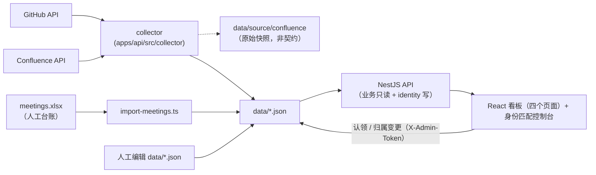

# 08 · 数据采集目录（Data Catalog）

> 依赖文档：`04-data-and-api-contract.md`、`05-integration-roadmap.md`
> 定位：**从数据视角**登记本看板（数据集成看板）所采集 / 展示的每一项数据——从哪来、怎么采、怎么归类、是否已实现、未实现还缺什么。
> **本文件可自由编辑**：它是登记册（registry），**不定义契约**；字段与接口的权威定义以 `04` 为唯一来源。发现不一致时直接修订本文件，或按 `04 §6.1` 发起契约变更。

## 0. 使用说明

**状态**：✅ 已实现（`data/*.json` 有真实数据且链路可跑通）｜🟡 计划中（接口/模型已预留，无采集器或数据为空）｜➖ 派生（无独立采集，由其它数据计算）

**采集方式**：人工维护（运营编辑 JSON/Excel）｜采集脚本（脚本从文件/API 生成 JSON）｜外部 API（GitHub/Confluence/Zoom）｜派生（无采集动作）

**排序约定**：§1 汇总按 **页面 → 页面内数据（自上而下）→ 平台横切** 排列，§2 详细描述沿用同一编号。

```mermaid
flowchart LR
  GH["GitHub API"] --> C["collector<br/>(apps/api/src/collector)"]
  CF["Confluence API"] --> C
  C -.-> SN["data/source/confluence<br/>（原始快照，非契约）"]
  XL["meetings.xlsx<br/>（人工台账）"] --> MS["import-meetings.ts"]
  MAN["人工编辑 data/*.json"] --> D
  C --> D["data/*.json"]
  MS --> D
  D --> API["NestJS API<br/>（业务只读 + identity 写）"]
  API --> WEB["React 看板（四个页面）+ 身份匹配控制台"]
  WEB -->|"认领 / 归属变更（X-Admin-Token）"| D
```

## 1. 汇总（一句话速览）

### 1.1 首页 `/`

| 编号 | 数据 | 一句话描述 | 状态 | 采集方式 |
| --- | --- | --- | --- | --- |
| H1 | 伙伴单位数 `partnerCount` | 与社区签署共建协议的组织数（`type=partner`） | ✅ | 人工维护（目标自动聚合） |
| H2 | 外部开发者数 `externalDeveloperCount` | 参与过贡献、未归属任何组织的独立开发者人数 | ✅ | 外部 API 回填 |
| H3 | 社区峰会场次 `summitCount` | 峰会与全体峰会的累计场次 | ✅ | 人工维护（目标聚合 `summits.json`） |
| H4 | 应用案例数 `useCaseCount` | 社区沉淀并通过评审的可运行案例数 | ✅ | 人工维护（**缺底层清单**） |
| H5 | 下一次峰会 `nextSummit` | 尚未结束、`endDate` 最晚的一场峰会 | ➖ | 派生（`home.nextSummitId` → `summits.json`） |
| H6 | 贡献组织卡片墙 | 全量组织按综合贡献分降序展示，零分显示「暂无贡献」 | ➖ | 派生（组织档案 + GitHub/Confluence 贡献） |

### 1.2 社区活跃度 `/activity`

| 编号 | 数据 | 一句话描述 | 状态 | 采集方式 |
| --- | --- | --- | --- | --- |
| A1 | 组织 GitHub 贡献明细 | 各组织的已合并 PR、PR 内提交、Issue、代码量与参与仓库数 | ✅ | 外部 API（GitHub GraphQL） |
| A2 | 个人贡献排行 | 以 GitHub 账号为维度、带协作指标的个人贡献者（含独立开发者） | ✅ | 外部 API 回填 |
| A3 | Confluence 成果（需求 / 议题分享） | 各组织在 Confluence 的需求数（需求页 `Contacts` 列的 @）与议题分享次数（会议纪要 `Agenda` 段的 @，按期去重）；归属为**生效归属**（人工认领优先，ADR-0010） | ✅ | 外部 API（Confluence CQL + 正文） |
| A4 | 组织贡献分布（环形图） | 按组织提交数（`github.commits`）计算的占比，**列出全部参与组织**（不再并入「其他」）；Confluence 视图下按 `requirements` | ➖ | 派生（复用 A1 / A3） |
| A5 | 贡献聚合总量 | 各指标总量与数据更新时间（页头展示） | ➖ | 派生（A1 + A3） |
| A6 | 时间区间筛选 | `from` / `to` 区间过滤，阶段一接收但不生效 | 🟡 | —（阶段三由采集游标切片） |
| A7 | Confluence 账号级明细 | 账号 × 三个维度（需求 / 议题分享 / 编辑）的明细，供 Confluence 视图个人区块与候选池取数 | ✅ | 外部 API（同 A3，落后 `confluence-accounts.json`） |
| A8 | 活跃来源切换 | 顶部切换 GitHub / Confluence 两套口径，状态写入 URL `?source=` | ➖ | 派生（前端） |

### 1.3 社区参展 `/summits`

| 编号 | 数据 | 一句话描述 | 状态 | 采集方式 |
| --- | --- | --- | --- | --- |
| S1 | 峰会时间线 | 每场峰会的名称、起止时间、地点、官网与「是否未结束」 | ✅ | 人工维护 |
| S2 | 峰会详情 | 简介、主办方、参会人数、参会组织名单、议程要点、成果与纪要链接 | ✅ | 人工维护 |
| S3 | 峰会规模指标 | 峰会场次、累计参会人次、去重参会组织数、即将召开场次 | ➖ | 派生（S1 + S2） |

### 1.4 例会参会情况 `/meetings`

| 编号 | 数据 | 一句话描述 | 状态 | 采集方式 |
| --- | --- | --- | --- | --- |
| M1 | 例会参会矩阵 | 「人 × 日期」二维台账，`true=出席`、空白=缺席 | ✅ | 采集脚本（Excel 台账导入） |
| M2 | 出席率与出席人数 | 个人出席次数 / 全部场次、每场出席人数 | ➖ | 派生（前端计算） |
| M3 | 准实时参会记录 | 由会议系统（Zoom）自动回填参会名单，替代手工台账 | 🟡 | 外部 API（远期） |

### 1.5 平台与横切数据

| 编号 | 数据 | 一句话描述 | 状态 | 采集方式 |
| --- | --- | --- | --- | --- |
| P1 | 组织档案 | 全站组织主数据（主键、类型、别名、邮箱域名、Logo 等） | ✅ | 人工维护 |
| P2 | 个人贡献者档案 | 人工档案 + 采集回填的 GitHub 协作指标（按 `githubId` 归并） | ✅ | 人工维护 + 外部 API |
| P3 | 数据更新时间 | 各文件信封的 `updatedAt`，供前端展示 | ➖ | 派生（文件信封） |
| P4 | 采集运行状态 | 采集游标、配额、未归属登录名、仓库集合等运行态 | ✅ | 采集器写入（非契约） |
| P5 | 自然人档案 | 跨来源认定为同一个人的**身份根**（`personId` + 展示名 + 归属组织） | ✅ | 人工维护（身份匹配控制台） |
| P6 | 身份认领映射 | 自然人 ←→ 来源账号的**认领边**（`source` + `accountKey`） | ✅ | 人工维护（身份匹配控制台） |
| P7 | 身份候选池 | 待认领 / 已认领的来源账号池，按来源分组 | ➖ | 派生（P2 贡献者 + M1 例会列名 + Confluence 来源） |
| P8 | 组织花名册 | 各组织下的开发者清单与人数 | ➖ | 派生（P5 的 `orgId` 分组，非落盘） |

## 2. 详细描述

> 每项含：**状态 / 来源 / 采集方式 / 字段 / 归类口径 / 未实现需补**；通用归属与计分规则见 §3。

### 2.1 首页 `/`

**H1 伙伴单位数 `partnerCount`**
- 状态：✅（当前为人工维护的单一数字）。
- 来源：`data/home.json` → `data.partnerCount`（`MetricValue`：`value`/`unit`/`delta`/`deltaDirection`）。目标口径 = `organizations.json` 中 `type=partner` 的档案数。
- 归类：由组织档案 `type` 决定（§3.1）。
- 现状提示：`home.json` 当前 `value=10`，而 `organizations.json` 中 `type=partner` 仅 4 条，**不一致**，说明仍是手工估值，未与档案对齐。
- 未实现需补：① 增加聚合任务，把 `type=partner` 计数回写 `home.json.partnerCount.value`；② `delta`/`deltaDirection` 需基于历史快照（`data/.snapshots/`）算环比，否则只能人工填。

**H2 外部开发者数 `externalDeveloperCount`**
- 状态：✅（GitHub 采集器自动回填）。
- 来源：`data/home.json` → `data.externalDeveloperCount`；数值派生自 `data/github-accounts.json`。
- 采集：外部 API —— 采集器每轮统计 `github-accounts.json` 中 `orgId` 为空的条数并写回 `home.json`。
- 归类：`orgId` 为空 = 未归属的独立贡献者（判定见 §3.2）。当前 `value=13`，与 `.sync-state.json` 的 `unattributedLogins`（13 个登录名）一致。
- 口径边界（重要）：统计的是**参与过贡献**的独立开发者，不等于「注册的外部开发者总数」。
- 未实现需补：如需统计「仅注册未贡献」者，需要新增独立的人才/会员数据源。

**H3 社区峰会场次 `summitCount`**
- 状态：✅（人工维护）；目标口径 = `summits.json` 条目数。
- 来源：`data/home.json` → `data.summitCount`。
- 未实现需补：改为由 `summits.json` 长度自动聚合，避免与 S1 时间线不一致。

**H4 应用案例数 `useCaseCount`**
- 状态：✅ 数字已展示，但**缺底层数据**（仅手工数字，无案例清单）。
- 来源：`data/home.json` → `data.useCaseCount`；口径写作「年度案例登记表中通过评审的案例数」，但当前**不存在**对应数据文件。
- 未实现需补：① 新建 `data/use-cases.json`（名称、`orgId`、年份、链接、评审状态、是否可运行）；② 新增 `GET /api/use-cases`，首页聚合「评审通过」案例数；③ 若登记在 Confluence，可复用 A3 采集器（按结构选择器或标签统计）。

**H5 下一次峰会 `nextSummit`**
- 状态：➖ 派生。
- 来源：`home.json` 只存引用 `nextSummitId`，不存峰会本体（避免双份维护）。
- 推导规则：优先取 `nextSummitId` 指向的峰会；若未配置、指向不存在或已结束，回退为「未结束峰会中 `endDate` 最晚的一场」；仍无则 `null`。
- 归类：`isUpcoming` 一律按 `endDate >= 当前时间` **动态重算**，即「未结束」而非「未开始」。
- 未实现需补：无需；只需运营保证 `summits.json` 持续录入未来峰会。

**H6 贡献组织卡片墙**
- 状态：➖ 派生。
- 来源：`organizations.json`（全量档案）+ `github-organizations.json`（A1）+ `confluence-organizations.json`（A3）。
- 口径：展示**全部**组织（含零贡献），按 `contributionScore` 降序；公式与阈值见 §3.3；零分组织渲染为「暂无贡献」。
- 独立开发者卡片：未归属贡献者以伪组织 `unattributed`（`type=individual`）参与展示，人数取 H2；该伪组织**不计入**伙伴/外部/社区组织计数。
- 未实现需补：计分公式现为固定常量。若需可配置权重或排除机器账号（如 `dependabot`），需把权重与排除名单落为配置项。

### 2.2 社区活跃度 `/activity`

**A1 组织 GitHub 贡献明细**
- 状态：✅ 已实现。来源：`data/github-organizations.json`（每组织一条）。
- 采集：外部 API —— `apps/api/src/collector`（`GithubCollectorService` + `GithubGraphqlSource`），`npm run collect:github`（增量）/ `npm run collect:github:full`（全量）。
  - 全量：逐仓库遍历 `repository.pullRequests(states: MERGED)` + `repository.issues`，**规避搜索接口单查询 1000 条上限**；
  - 增量：`search` 限定 `is:pr is:merged merged:>lastSyncAt` 与 `is:issue created:>lastSyncAt`，以 `total_count ≥ 1000` 作截断告警。
- 字段与口径：

  | 字段 | 含义 | 口径要点 |
  | --- | --- | --- |
  | `github.pullRequests` | PR 数 | **仅已合并**（merged），不含 open / closed-unmerged |
  | `github.commits` | 提交数 | **已合并 PR 内**的提交总数（逐 PR 累加 `commits.totalCount`），不含直推提交 |
  | `github.issues` | Issue 数 | 提出或参与（含评论 / 被指派） |
  | `github.linesChanged` | 代码量 | **PR 级** `additions + deletions` 累加，**不过滤文件类型** |
  | `github.repos` | 参与仓库数 | 由 PR / Issue 记录中的仓库集合去重得出 |

- 落盘策略：以 `orgId` 为唯一键；`full` 整体替换、`incremental` 在既有基线上叠加（仓库集合由 `.sync-state.json` 求并集），保证幂等、不清零。
- 统计范围：限定 `GITHUB_ORGS` 下公开仓库，可再用 `GITHUB_REPOS` 白名单收窄。
- 未实现需补：范围配置目前依赖 `.env`；若需多环境共享口径，建议纳入受版本管理的配置。

**A2 个人贡献排行**
- 状态：✅ 已实现。来源：`data/github-accounts.json`（同时服务 P2 与个人排行）；接口 `GET /api/contributor-contributions`。
- 采集：外部 API —— 采集器以 `githubId`/`contributorId`（GitHub login）归并个人 PR/Issue/提交后写入 `github` 指标。
- 口径：字段结构与 A1 完全一致；**个人之和 = 组织之和**（含伪组织 `unattributed`），可互相核对。
- 筛选/排序：`orgIds` 命中时，`orgId` 为空的独立贡献者按 `unattributed` 匹配；默认按 `commits` 降序，前端二次排序取 Top 8。
- 未实现需补：`from`/`to` 阶段一接受但不生效（采集侧无个人级时间切片）；如需区间排行，需按时间维度保留明细。

**A3 Confluence 成果（需求 / 议题分享 / 编辑）**
- 状态：✅ 已实现（三个维度均取真实值）。来源：`data/confluence-organizations.json`；接口 `GET /api/wiki`。执行 `npm run collect:wiki`（详见 `docs/05` §3、`docs/adr/0009` 与 `docs/adr/0011`）。
- 采集：外部 API —— 三段式：① Confluence REST v1 `/search` + CQL（`space in (...) and type=page`，`expand=space,version,history,metadata.labels,ancestors`）列举目标空间全部页面，分页用 `_links.next` 游标（`limit=100`）；② 对**空间内全部页面**逐页 `GET /wiki/api/v2/pages/{id}/versions`（`limit=200`，按 `_links.next` 游标翻页，上限 20 页）取版本历史，按**版本作者**累计编辑量（ADR-0011；v2 端点只给 `authorId`，展示名仍从正文渲染视图换出）；③ 对**结构选择器命中页**、并上「尚无名字来源的作者所编辑的页」（补名差集，避免为换展示名多跑一轮全量正文）逐页 `GET /rest/api/content/{id}?expand=body.storage,body.view` 取正文并解析（`body.view` 用于取展示名，不额外发请求）。串行 + 固定间隔，单页失败只降级该页。**全量重算**：每轮整体替换 `confluence-organizations.json`（唯一键 `orgId`），不做增量（增量需逐页台账，风险大于收益）。
- 粒度（ADR-0008 / ADR-0010 / ADR-0011）：同轮落**账号级** `data/confluence-accounts.json`（`ConfluenceAccount`，主体是平台账号而非自然人；`schemaVersion` 已升至 **4**：v3 新增 `orgSource`、v4 在 `confluence` 下新增 `edits`）。接口对外按**生效归属** `effectiveOrgId` **读时派生**（`GET /api/wiki` 不再读组织级文件，见 04 §5.3.4 / §5.3.16）；`confluence-organizations.json` 仍由采集器写入，但降级为**基线快照**（非读路径来源）。组织级同名文件 `schemaVersion` 为 **3**（v2 字段改名、v3 新增 `edits`）。
- 字段：`confluence.requirements`（需求条数）、`confluence.topicShares`（议题分享次数）、`confluence.edits`（编辑量：页面版本作者条数，含创建那次，见 ADR-0011）。账号级另含 `orgId`（采集口径）、`orgSource`（`alias`/`space`/`unattributed`）、`personId`。
- 口径（ADR-0009）：
  - **需求** = `Requirement Proposal` 页（须位于 `Release Planning` 之下，排除 `Releases` 下的同名模板页）需求表格 `Contacts` 列里**每个 @ 提及各算 1 条**（一行两位联系人则两位各 1 条，故条数 = 提及数，不等于页数/行数；只取该列，表外 @ 不计）。
  - **议题分享** = 会议纪要页（标题匹配 `^\d{4}-\d{2}-\d{2} TSC Minutes$` 且父页匹配 `^\d{4} - TSC Minutes$`）`Agenda` 段**内**的全部 @（段落与表格行都算），**同一期同一账号最多 1 次**（同页 `Attendees & Representation` 段的 @ 是出席签到，不计入）。首次真实采集（2026-09-28 复核）：16 期会议 / 21 次分享 / 12 个分享账号（段内原始 @ 25 处，同期重复去重 4 处）。
  - **编辑**（ADR-0011）= 空间内**全部页面**的版本历史中，该账号作为**版本作者**出现的次数（**含页面创建那一次**，一页多版本、多人共编各计 1 条，**不做单页封顶**）。取数走 v2 `GET /pages/{id}/versions`（`limit=200` + `_links.next` 游标，上限 20 页），只认 `authorId`；作者展示名不由该端点提供，仍从正文渲染视图换出。
  - 选页用**结构选择器**（标题 + 祖先链 / 正则），**不看标签、不看标题关键字**（实测空间无任何需求标签）。
  - 全部选择器与列/段名均可经 `CONFLUENCE_REQUIREMENT_*` / `CONFLUENCE_MINUTES_*` 环境变量就地校正（留空取内置默认）。
- `bestPractices` 已**移除**：best-practice 内容不在 Confluence wiki 内，第二维改为真实可得的 `topicShares`（见 ADR-0009）。
- 归类（**生效归属**，ADR-0010）：**被 @ 或作为页面版本作者的账号**归属（优先级从高到低）——① **身份认领边**（P6 `identity-claims.json` 中 `source=confluence` 且 `accountKey=accountId` → `Person.orgId`，**人工优先**）；② `Organization.aliases.confluence` 精确匹配（accountId / 展示名 / 空间 key）；③ 空间兜底；④ 伪组织 `unattributed`。其中 ②③④ 为**采集口径**（写入账号级 `orgId` + `orgSource`），① 为**读时派生覆写**。未命中账号写入独立状态文件 `unattributedAccounts[]`（语义为「未经认领 / 别名归属的待办清单」）；正文里写成纯文本 `@人`（解析不出 accountId）写入 `unresolvedContacts[]`，均供运营补录（补录后**认领即生效**，无需重跑采集器；补别名仍需重跑）。
- 展示名（只影响可读性，不参与计数与归属）：兜底顺序为**渲染视图 `body.view`**（随正文一并取回，零额外请求）→ 正文 `ri:username` → 页面创建者展示名 → `GET /rest/api/user` → accountId。实测正文只有 `ri:account-id`、`/rest/api/user` 返回 403，但渲染视图已带出展示名；引入编辑量后，正文取页范围额外并入「尚无名字来源的作者所编辑的页」，故 21 个账号**全部为真名**（无一落 accountId 兜底）；日志按来源分档计数。
- 输出兜底：聚合覆盖组织档案全部组织（含 `unattributed`），未命中者记 0，保证活跃度页 join 无空洞。**需求 / 议题分享两维全为 0 视为异常，中止写入并保留旧数据**；`edits` **刻意不进入**该保护——版本接口失败只降级为「该页无编辑量」，不连带阻断既有两维落盘，仅在「本轮编辑量全为 0 而既有数据非 0」时告警（见 ADR-0011）。
- 状态与快照：独立状态文件 `data/.sync-state.confluence.json`（不复用 GitHub 的 `.sync-state.json`，避免覆盖其游标）；原始页面快照落 `data/source/confluence/`（非契约、接口与前端不可见）。
- 未实现需补：① `aliases.confluence` 仍全部为空，故**组织归属**整体落 `unattributed`（`source=confluence` 认领边已有 4 条，账号级 `personId` 快照已部分落盘）；最新一轮真实采集为 **21 个账号 / 三个维度**，合计需求 **38** / 议题分享 **20** / 编辑 **672**，与 `confluence-organizations.json` 的 `unattributed` 行逐字段一致——账号级落盘已能给出**具体账号 + 三个维度的量**；运营据此**补认领边后活跃页立即生效**，补别名则需重跑采集器；② 口径依赖正文结构（列名/段名/层级）与 v2 版本端点，改版即解析不到（正文选择器已做成环境变量 + 两条自检信号）；③ `from`/`to` 时间切片不适用（全量累计值）。

**A4 组织贡献分布（环形图）**
- 状态：➖ 派生。来源：复用 A1（`GET /api/contributions`）。
- 口径：前端按组织 `github.commits` 计算占比；**每个有非零计数的组织各占一个具名扇区**，不再并入「其他」（无 3% 阈值与扇区数上限，见 ADR-0013）。Confluence 视图复用同一卡片，改为按组织 `confluence` 的**三个维度**（需求 / 议题分享 / 编辑）切换占比口径（见 ADR-0011）。
- 未实现需补：无需。

**A5 贡献聚合总量**
- 状态：➖ 派生。来源：A1 + A3 的服务端聚合；接口 `GET /api/contributions/summary`。
- 口径：`totals`（`pullRequests`/`commits`/`issues`/`linesChanged`/`requirements`/`topicShares`/`edits`）+ `orgCount` + `updatedAt`（取参与记录的最新 `updatedAt`）。
- 未实现需补：`requirements`、`topicShares` 与 `edits` 均已随 A3 落地取真实值（各组织求和，见 ADR-0011）。

**A6 时间区间筛选**
- 状态：🟡 计划中（参数已接收，阶段一不过滤）。来源：请求参数 `from`/`to`（ISO 8601）。
- 采集：阶段三由采集器在落盘时按 `lastSyncAt` 游标切片决定区间；接口恒只读落盘结果。
- 未实现需补：采集侧需保留时间维度明细（当前落盘为累计值），否则区间筛选无法真正生效；接口与前端无需改动。

**A7 Confluence 账号级明细**
- 状态：✅ 已实现。来源：`data/confluence-accounts.json`（账号级 `schemaVersion` = **4**）；接口 `GET /api/confluence-accounts`（生效口径）。
- 采集：与 A3 同轮同源，账号级落盘（含 `edits`，见 ADR-0011）。
- 用途：活跃度页 Confluence 视图的账号榜（`useConfluenceAccounts` → `ConfluenceAccountRankCard`）、身份控制台候选池（P7）取数；每条记录**至少满足一项**：在需求表格被 @、在会议纪要 `Agenda` 段被 @、或是页面版本作者（故三个指标可同时为 0）。
- 未实现需补：无。

**A8 活跃来源切换**
- 状态：➖ 派生（前端）。来源：URL query `?source=github|confluence`。
- 口径：切换只改变渲染的数据源与列（GitHub 指标 / Confluence 指标），筛选条件保留；默认 `github`。
- 未实现需补：无。

### 2.3 社区参展 `/summits`

**S1 峰会时间线**
- 状态：✅ 已实现。来源：`data/summits.json`。采集方式：**人工维护**（手动录入）。
- 字段：`id`、`name`、`startDate`、`endDate`、`location`、`websiteUrl`、`isUpcoming`。
- 归类：`isUpcoming` 由服务端按 `endDate` 动态重算（「未结束」）；列表默认按 `startDate` 降序，前端按年份分组。
- 未实现需补（可选自动化）：目前无自动来源。若想减少人工，可从活动官网 / LF 事件页 / Event API 采集基础信息；但 `id` 与展示口径仍需人工兜底，**短期建议维持人工维护**。

**S2 峰会详情**
- 状态：✅ 已实现。来源：`data/summits.json`（在 S1 基础上扩展字段）。采集方式：人工维护。
- 字段：`description`、`hostOrgId`、`host`、`attendeeCount`、`attendingOrganizations`、`agendaHighlights`、`outcomes`、`minutesUrl`。
- 归类：① `hostOrgId` 关联组织档案，缺失时以 `host` 文本兜底；② `attendingOrganizations` **存组织名称字符串**（便于人工维护），前端/服务层按 `name`/`aliases` 反查 `orgId`；③ `minutesUrl` 缺失时前端展示 `—`。
- 未实现需补：① `attendeeCount` 当前真实数据为 `0`（示例），需人工补录或从票务/报名系统采集；② 真实数据中的 `attendingOrganizations` 含大量尚未登记在 `organizations.json` 的单位（如 TELUS、Airtel、NTT DOCOMO 等），反查 `orgId` 会落空——需运营按需补充档案，或明确「峰会组织名允许不建档案」。

**S3 峰会规模指标**
- 状态：➖ 派生。来源：S1 + S2。
- 口径：峰会场次 = 全量条数；累计参会人次 = 各场 `attendeeCount` 累加；参会组织 = 各场 `attendingOrganizations` 去重计数；即将召开 = `isUpcoming` 计数。

### 2.4 例会参会情况 `/meetings`

**M1 例会参会矩阵**
- 状态：✅ 已实现。来源：产物 `data/meetings.json`；**源台账** `data/source/meetings.xlsx`（台账**不是契约文件**，接口不读、前端不可见）。
- 采集：采集脚本 —— `apps/api/scripts/import-meetings.ts`，运行 `npm run collect:meetings`。
- 解析约定：读首个工作表，第 1 行为表头（`A1` 为日期列标签，`B1..` 为人名），第 2 行起每行一场例会；日期兼容 Excel 序列号与 `YYYY-MM-DD`/`YYYY/MM/DD`；出席记号宽容匹配（`√`/`✓`/`Y`/`1`/`是`/`x`/`X`/`出席` → `true`，空与其它值 → `false`）。
- 归类（**刻意不规范化**）：① 矩阵**无主键**，`columns` 是 Excel 表头**人名原文**，**不关联** `Organization`/`Contributor`；② **空白 = 缺席**，且计入出席率分母——成员加入前的历史空白同样拉低出席率（已接受的负债）；③ 行序、列序**严格保留台账原序**，接口与前端**均不重排**；新增成员追加末尾，离场成员保留列；④ 不含会议元信息（时长/主持人/议程/地点），不含聚合字段。
- 未实现需补（见 `05 §10.4`）：① 拿到真实台账后按实际记号校准出席判定映射；② 台账列名一致性由运营保证（改名/重名/空格会产生重复列，静默算错出席率）；③ 接 Zoom 前需先补稳定人员标识 `personId`（见 M3）。

**M2 出席率与出席人数**
- 状态：➖ 派生。来源：M1。采集方式：无，**由前端计算**（`present / rows.length` 与每场出席人数），接口不返回聚合值。
- 未实现需补：若需「按组织统计出席率」，需先把 M1 人名映射到组织（当前无关联）——与 M3 的 `personId` 需求合并处理。

**M3 准实时参会记录**
- 状态：🟡 计划中（远期）。来源（目标）：会议系统（Zoom）参会报告。
- 采集（计划）：外部 API，自动回填参会名单，替代手工 Excel 台账。
- 未实现需补：① 引入稳定人员标识 `personId`，建立 `personId ↔ 人名原文 ↔ 组织` 映射（当前列名是人名原文，改名/重名会静默错算）；② 明确参会判定规则（入会时长阈值等），避免「登录即算出席」；③ 先完成 M1 列名规范化，再接 Zoom。

### 2.5 平台与横切数据

**P1 组织档案**
- 状态：✅ 已实现（人工维护）。来源：`data/organizations.json`。
- 字段：`orgId`（主键）、`name`、`logoUrl`、`homepageUrl`、`type`、`tags`、`aliases`、`emailDomains`、`joinedAt`、`description`。
- 归类：`type ∈ {partner, external, community, individual}`；`individual` 仅供伪组织 `unattributed` 使用（§3.1）。`aliases`（多源别名）与 `emailDomains` 是 §3.2 归属判定的核心输入。
- 未实现需补：当前多数组织 `aliases.github`/`aliases.confluence` 为空，归属只能依赖邮箱域名兜底；建议运营补齐别名，提高归并准确率。

**P2 个人贡献者档案**
- 状态：✅ 已实现（混合实体）。来源：`data/github-accounts.json`。
- 字段：`contributorId`（主键，对齐 GitHub login）、`githubId`（去重/归并键）、`name`、`orgId`（可空）、`avatarUrl`、`joinedAt`、`description`、`github`（采集回填）。
- 归类：**人工维护字段**（`joinedAt`/`description`/人工指定的 `orgId`）与**采集字段**（`github` 指标、`name`/`avatarUrl` 回填）分离；采集**不会覆盖**人工已指定的 `orgId` 与已填名称。
- 未实现需补：`joinedAt`/`description` 无采集来源，需运营手工补；若希望自动获取加入时间，可用其首个贡献时间回填（当前未实现）。

**P3 数据更新时间**
- 状态：➖ 派生。来源：各文件信封字段 `updatedAt`（及 A5 的聚合最新时间）；由写入方（人工/采集器）落盘时写入。
- 未实现需补：采集失败时后端会附加 `X-Data-Stale: true`；若前端需显式提示「数据陈旧」，需补充该响应头的展示逻辑。

**P4 采集运行状态**
- 状态：✅ 已实现（**非契约**，前端不可见，可随时删除）。来源：`data/.sync-state.json`，采集器写入。
- 字段：`lastSyncAt`/`lastRunAt`/`lastMode`/`status`、`rateLimitRemaining`、`unattributedLogins`（未归属登录名清单）、`orgRepos`/`personRepos`（仓库集合）、`recordCount`。
- 归类：仅存采集元信息，**不污染业务数据文件**；删除后触发全量采集。历史快照位于 `data/.snapshots/`（保留最近 7 份，用于回滚）。
- 未实现需补（可选）：`unattributedLogins` 目前只落盘、无界面；建议在运营侧建立「未归属登录名 → 组织」补录流程，闭环提高归属率。

**P5 自然人档案**
- 状态：✅ 已实现（人工维护，**写侧**）。来源：`data/persons.json`（信封包裹 `Person[]`，初始为 `[]`）。
- 字段：`personId`（主键，slug，创建后不可变）、`displayName`、`orgId`（可空，归属组织）、`avatarUrl`（可选）、`createdAt`/`updatedAt`。档案一经创建仅可改名与调整归属，删除为不可逆物理删除（仅限误建）。
- 归类：**自然人 = 跨来源身份根**，是 P6 认领边的唯一锚点，不复用 P2 `Contributor`（后者是 GitHub 账号维度档案）。`orgId` 是**自然人级**归属且为**唯一真相**（§3.2 的 `Contributor.orgId` 是账号级归属，两者并存、互不覆盖）。
- 未实现需补：自然人与 P2 `Contributor`、M1 例会列名、Confluence 账号之间**目前仅靠人工认领**，无自动归并规则（如 login 与人名相似度）；`avatarUrl` 需人工或认领后回填。

**P6 身份认领映射**
- 状态：✅ 已实现（人工维护，**写侧**）。来源：`data/identity-claims.json`（信封包裹 `IdentityClaim[]`，初始为 `[]`）。
- 字段：`claimId`（主键）、`personId`（外键 → P5）、`source`（`github`/`confluence`/`meeting`）、`accountKey`（来源内稳定标识：`githubId`／`accountId`／人名原文）、`displayName`（快照，可选）、`createdAt`、`createdBy`（可选）。
- 归类：**点边分离**——认领边与自然人分文件存放，认领 / 解除可独立发生，避免每次绑定重写整个自然人档案。解除匹配 = **物理删除该边**；**未认领池**定义为「没有被任何边引用的来源账号」，因此池无需维护状态位。
- 口径：**不做唯一性校验**（同一账号可被多人认领，前端提示冲突）；认领**不改变**任何历史贡献数据（贡献挂在 `githubId` 与列名原文上）。
- 未实现需补：无一键「按 login / 人名相似度推荐认领」；未来新增来源（如 Zoom 参会账号）只需扩展 `source` 枚举，`Person` 不动。

**P7 身份候选池**
- 状态：➖ 派生（不落盘、无数据文件）。
- 来源：`github` ← P2 `github-accounts.json`（`accountKey = githubId`）；`confluence` ← **数据已就绪、服务端尚未接线**（账号级 `data/confluence-accounts.json` 已随 ADR-0008 落地，`accountKey = accountId`，但 `CandidateService` 仍只读组织级 `confluence-organizations.json`：为空时提示「暂无数据」、非空时提示「账号级候选尚未接入」，两种情形都返回空数组且不报错）；`meeting` ← M1 `meetings.json` 的 `columns` 去重（`accountKey = 人名原文`）。
- 字段（`IdentityCandidate`）：`source`、`accountKey`、`displayName`、`avatarUrl`（仅 github）、`claimedBy[]`（空数组 = 待认领；长度 > 1 = 冲突）。
- 归类：候选池随来源采集自动同步，**零维护**；响应**不含邮箱等敏感身份字段**；单一来源缺失时仅降级为空数组并在 `warnings` 中说明。
- 未实现需补：无分页（当前量级数十～数百，全量返回）；**Confluence 分组尚未接线**——账号级来源 `data/confluence-accounts.json` 已就绪，待 `CandidateService` 改读该文件（并复用 `aliases.confluence` / 认领边判定已认领）后，候选池 `confluence` 分组即可产出数据。

**P8 组织花名册**
- 状态：➖ 派生（不落盘、无数据文件）。
- 来源：P5 `persons.json` 按 `orgId` 分组 + P1 组织档案（只读）。
- 字段（`OrgRosterEntry`）：`organization`（组织档案原文）、`memberCount`（**活跃**自然人数）、`members[]`（`personId`/`displayName`/`avatarUrl`/`status`）。
- 归类：归属**只存 `Person.orgId` 一处**，组织档案上**不存成员清单**（避免两份真相）；排除伪组织 `unattributed`，未归属者进 `unassigned`。归属写入唯一入口是 `PATCH /api/identity/persons/:personId`。
- 未实现需补：无「按组织导出花名册」；`memberCount` 与 P1 组织的贡献归属人数（来自 P2）**口径不同**，不可直接相减。

## 3. 归类与派生总则

### 3.1 组织类型（`Organization.type`）

| `type` | 含义 | 是否计入组织计数 |
| --- | --- | --- |
| `partner` | 伙伴单位（签署共建协议的企业/机构） | ✅（H1） |
| `external` | 外部开发者（以个人身份参与，代表某单位） | ✅（按需） |
| `community` | 社区自身的运营与维护组织 | ✅ |
| `individual` | **伪组织** `unattributed` 专用，不参与「伙伴单位」等计数 | ❌ |

### 3.2 贡献归属判定（优先级从高到低）

结果写入 `github-accounts.json` 的 `orgId`；未命中任何组织 → 伪组织 `unattributed`。

1. **登录名别名**：`Organization.aliases.github` 与贡献者 login（小写）精确匹配；
2. **邮箱域名**：命中 `Organization.emailDomains`（精确匹配优先，其次按 `.域名` 后缀匹配子域，如 `mail.huawei.com` → `huawei.com`）。邮箱信号优先取 **PR 首个提交的作者邮箱**，缺失时退化为账户**公开资料邮箱**；
3. **独立开发者兜底**：以上均未命中 → `unattributed`。

补充：邮箱**仅用于内存判定，不写入任何数据文件**（`@users.noreply.github.com` 等自然不命中）；人工在 `github-accounts.json` 已指定的 `orgId` **不会被自动覆盖**；多组织配置相同域名时按组织档案顺序取第一个。

> **本节只适用于 `Contributor.orgId`（GitHub 账号级归属）。** 身份匹配控制台维护的 `Person.orgId`（自然人级归属，见 P5/P8）是**独立口径**：不参与本节判定，也不被采集器改写；两者并存且互不覆盖。

### 3.2.1 Confluence 归属（A3，ADR-0009）

Confluence 归属是**两层**：**采集口径**写入账号级 `confluence-accounts.json` 的 `orgId`（+ `orgSource`）；**生效归属** `effectiveOrgId`（接口对外值）在其上叠加认领边（ADR-0010）。与 3.2 的 GitHub 口径**相互独立**。生效归属优先级从高到低：

1. **身份认领边**（**人工优先**，读时派生）：`identity-claims.json` 中 `source=confluence` 且 `accountKey=accountId`（小写归一）的认领边 → `Person.orgId`；命中则 `orgSource='claim'`；
2. **空间别名**（采集口径）：`Organization.aliases.confluence` 与**被 @ 的账号** `accountId` / 展示名 / 空间 key 精确匹配（大小写不敏感）；命中 `orgSource='alias'`；
3. **空间兜底**（采集口径）：账号所属空间命中某组织映射；命中 `orgSource='space'`；
4. **独立开发者兜底**：以上均未命中 → `unattributed`（`orgSource='unattributed'`），并把账号写入独立状态文件 `unattributedAccounts[]`。

> 关于「页面显式归属字段」：Confluence 侧登记的组织标识在当前空间未启用，采集器**未实现**该路径，故不列入优先级。

说明：**按「被 @ 或作为页面版本作者」的账号归属**（需求取 `Contacts` 列、议题分享取 `Agenda` 段内 @、编辑取页面版本历史作者），账号到组织的归属不按页面创建者推断、也不逐页继承父页面组织；`requirements` / `topicShares` / `edits` 三个计数**共用同一套账号级归属结果**（同一账号一律落到同一 `effectiveOrgId`）。**采集口径每轮全量重算**（整体替换 `confluence-accounts.json`），**生效归属每请求读时派生**——故**补认领边后活跃页立即生效**（无需重跑采集器），补 `aliases.confluence` 则需重跑采集器。组织级 `confluence-organizations.json` 由账号级求和派生，但**已非读路径来源**（`GET /api/wiki` 读时按 `effectiveOrgId` 求和）。

### 3.3 综合贡献分（H6 卡片墙）

- **公式**：`score = (PR + Issue + 需求 + 议题分享 + 编辑量) + linesChanged / 10000`（协作频次为主，代码量按万行折算，避免体量压倒频次），四舍五入取整。编辑量与 PR / Issue / 需求 / 议题分享同属「行为频次」，**直接计入**（见 ADR-0011）。
- **等级阈值**：`high ≥ 600`、`medium ≥ 100`、其余 `low`；零分组织同样返回且排末尾。加入编辑量后行为项量级整体抬高，阈值由 `300 / 100`（ADR-0001）**按新量级重标定**为 `600 / 100`：实测组织分非零值为 `[1, 45, 527, 802]`，取 `600 / 100` 后高 / 中 / 低档成员与引入编辑量前**完全一致**（ADR-0011）。
- **输入**：`github-organizations.json`（GitHub）+ `confluence-organizations.json`（Confluence），均以 `orgId` 关联；两者缺失即视为 0。

### 3.4 派生的共同原则

- 派生一律发生在**服务层或前端**，不新增数据文件、不引入额外主键；
- 派生数据不得反向写回业务 JSON（唯一例外：采集器把 `externalDeveloperCount` 写入 `home.json`）；
- 展示口径（排序、占比、去重、阈值）集中在本节与 `04`，改动需同步两处。

## 4. 待办汇总（未实现 / 待补齐）

| 优先级 | 编号 | 待办 | 依赖 / 前置 |
| --- | --- | --- | --- |
| 高 | H4 | 新建 `data/use-cases.json` + `GET /api/use-cases`，让「应用案例数」可追溯 | 运营确认案例字段 |
| 高 | M1 | 按真实台账校准出席记号映射，确认列名规范 | 真实 `meetings.xlsx` |
| 中 | H1/H3 | 由组织档案 / `summits.json` 自动聚合 `partnerCount`、`summitCount` | 无（Service 层即可） |
| 中 | P1 | 补齐组织 `aliases`，提升归属准确率 | 运营录入 |
| 中 | S2 | 补录峰会 `attendeeCount`；补齐参会组织档案 | 运营录入 / 报名系统 |
| 低 | A6 | 采集侧保留时间维度，使 `from`/`to` 生效 | 采集器改造（阶段三）|
| 中 | A3 | Confluence 归属回归：运营补 `source=confluence` 认领边（**认领后活跃页立即生效**）或 `aliases.confluence`（需重跑采集器）、修正正文纯文本 `@人`（当前真实数据全部落 `unattributed`，见状态文件 `unattributedAccounts` / `unresolvedContacts`） | 运营录入（采集器已就绪） |
| 中 | A9 | GitHub 侧归属收敛：让人工认领同样影响 GitHub 展示口径（与 Confluence 对齐），并消除组织级 / 账号级双写 | 需另立 ADR（当前 GitHub 仍为双口径并存） |
| 中 | P6 | 自动匹配建议（按 GitHub login / 人名相似度推荐认领对象） | P5/P6 数据积累后 |
| 低 | M3 | 接 Zoom API 自动采集参会，并把参会账号认领到 P5 自然人 | P5 已就绪；依赖 M1 列名规范化 |
| 低 | H6 | 贡献分权重 / 排除名单（如 `dependabot`）可配置化 | 配置项设计 |
| 低 | P4 | 「未归属登录名 → 组织」补录流程 | 运营流程 |

## 5. 维护约定

- 本文件为**登记册**：新增 / 调整数据时同步更新 §1 汇总与 §2 对应条目；
- 若某项状态由 🟡 变为 ✅，请同时勾掉 §4 待办中的对应行；
- 与 `04-data-and-api-contract.md` 冲突时**以 `04` 为准**，并在此记录差异；
- 本文件不参与 CI 校验（属「可自由编辑」文档）。
