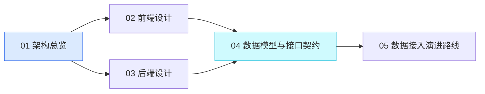

# OpenAN 社区运营洞察平台 · 架构设计文档

本目录是 **OpenAN Community Operation Insights（社区运营洞察平台）** 的架构设计文档集。

**当前状态**：设计基线已定稿并进入实现阶段。代码工程（`apps/api`、`apps/web`）与种子数据（`data/`）已落地，本目录作为设计与契约基线持续维护。
**文档版本**：v1.7 ｜ **最后更新**：2026-09-24

---

## 1. 项目说明

一个面向 OpenAN 社区运营团队的**数据看板网站**，由一个顶部导航栏与四个内容页组成，用于集中呈现社区规模指标、各成员单位的贡献度、历次峰会信息，以及例会参会情况。

| 页面 | 路由 | 核心内容 |
| --- | --- | --- |
| 首页 | `/` | 社区伙伴数量、外部开发者数量、参加的峰会、应用案例、下一次峰会、贡献的组织 |
| 社区活跃度情况 | `/activity` | 按组织汇总的 PR / Issue / 代码量，需求 / best-practice 案例，以及组织提交占比分布 |
| 社区参展 | `/summits` | 峰会时间线（名称、时间、地点、官网）+ 每场峰会的详情表格 |
| 例会参会情况 | `/meetings` | 例会参会矩阵（人 × 日期），行头附当次出席人数、列头附个人出席率 |

---

## 2. 文档索引

| 文档 | 内容 | 主要读者 |
| --- | --- | --- |
| [01-architecture-overview.md](./01-architecture-overview.md) | 系统上下文、分层架构、技术选型与理由、架构原则、部署形态、目录与命名约定、风险登记 | 所有人、评审者 |
| [02-frontend-design.md](./02-frontend-design.md) | 路由设计、四页面区块拆解与**字段级清单**、组件树、TanStack Query 缓存策略、设计系统、响应式与主题 | 前端工程师、设计师 |
| [03-backend-design.md](./03-backend-design.md) | NestJS 模块划分、分层职责、**Provider 端口接口签名**、DI Token 与绑定集中点、采集器读写分离、JSON 仓储原子写、DTO、错误码表、日志规范 | 后端工程师 |
| [04-data-and-api-contract.md](./04-data-and-api-contract.md) | **JSON 数据模型 schema**、实体字段定义、完整数据样例、**REST 接口契约**、契约治理 | 前后端工程师（必读） |
| [05-integration-roadmap.md](./05-integration-roadmap.md) | GitHub / Confluence 采集设计、增量与限流策略、调度与缓存、数据校验与回滚、里程碑与验收标准 | 后端工程师、运营负责人 |
| [06-known-issues.md](./06-known-issues.md) | 已知问题记录：现象、取证、结论与处置 | 所有人 |
| [07-feature-registry.md](./07-feature-registry.md) | **功能清单（可自由编辑）**：全站功能按概览 / 活跃度 / 参会 / 例会 / 平台与横切五组登记，含已实现、开发中、计划中、已否决四态与逐条实现说明 | 所有人、运营负责人 |
| [08-data-catalog.md](./08-data-catalog.md) | **数据采集目录（可自由编辑）**：从数据视角登记全站采集 / 展示的数据，按页面从高到低汇总，并逐项说明来源、采集方式、归类口径、实现状态与未实现待补项 | 所有人、数据源对接人、运营负责人 |
| [adr/](./adr/) | 架构决策记录（ADR）：背景、决策、理由与后果 | 所有人、评审者 |

### 2.1 推荐阅读路径

```text
新加入的工程师：README → 01 → 04 → （前端）02 / （后端）03
参与评审者   ：README → 01（重点看第 6、7 章：选型理由与架构原则）
运营负责人   ：README → 01 第 2 章 → 05 第 1、7 章（演进路线与里程碑）
数据源对接人 ：README → 04 第 3 章（字段口径）→ 05 第 2、3 章（采集设计）
```

### 2.2 依赖关系



**04 文档是唯一契约来源**：任何字段新增、改名、类型变更，都必须先改 04，再改代码。

---

## 3. 技术栈速览

| 层次 | 选型 |
| --- | --- |
| 前端 | React 18 + TypeScript + Vite 5 + React Router 6 + TanStack Query 5 + Tailwind CSS 3.4 + Recharts |
| 后端 | NestJS 10 + TypeScript + class-validator |
| 数据存储 | **JSON 文件**（`data/*.json`），通过 `JsonRepository` 抽象封装 |
| 外部数据源 | GitHub（GraphQL 采集，已实现于 `apps/api/src/collector`）、Confluence（CQL 检索，待接入） |

### 3.1 架构核心思想

**端口-适配器（Ports & Adapters）**：业务层只依赖 `Port` 接口，具体实现由 DI Token 绑定，使业务逻辑对数据来源无感知。

**但数据源的演进不走端口切换。** 按「采集写、接口读」的读写分离设计，采集器（`apps/api/src/collector`）把外部数据落盘为与种子数据**完全相同**的 JSON 结构，API 的六个端口**恒为 JSON 实现**：

```text
采集链路（写入）：GitHub API → collector/（映射、归并）→ data/*.json
请求链路（只读）：Controller → Service → Port（接口）→ Json 实现 → 读取 data/*.json
                                                  ↑
                        端口绑定集中于 ProvidersModule（换存储 / 直连上游时才动）
```

---

## 4. 本期范围（重要）

### 4.1 本期做什么

- ✅ 输出本目录下的五篇架构设计文档
- ✅ 定义完整的数据模型与接口契约，字段按**真实数据源语义**设计
- ✅ 定义 GitHub / Confluence 的接入端口与演进路线

### 4.2 本期不做什么

- ❌ 不创建前端或后端工程脚手架，不编写业务代码
- ❌ 不实现真实的 GitHub / Confluence 调用
- ❌ 不引入数据库、缓存中间件、消息队列
- ❌ 不做登录鉴权与后台管理界面
- ❌ 不做国际化多语言

### 4.3 「硬编码」的实现约定

需求中提到的"暂时硬编码"，在本架构中统一落在**后端 `data/*.json` 种子文件**，而不是前端组件常量。前端从第一天起就通过 HTTP 获取所有数据。

**原因**：若一部分数据走接口（如"贡献的组织"）、一部分写死在前端，后续接入真实数据时会出现两套数据路径，前端需要全面返工。统一后置到后端，使前端代码即为最终形态。

| 数据 | 位置 | 当前来源 | 未来来源 |
| --- | --- | --- | --- |
| 首页四项指标 | `data/home.json` | 人工维护 | 聚合自贡献数据 |
| 下一次峰会 | `data/home.json` → `nextSummitId` | 人工维护 | 自动推导（未结束峰会中最近一场） |
| 贡献的组织 | `data/organizations.json` | 人工维护 | 同左 |
| PR / Issue / 代码量 | `data/contributions.json` | 人工维护 | **GitHub API** |
| 需求 / best-practice | `data/insights.json` | 人工维护 | **Confluence API** |
| 个人贡献者档案 | `data/contributors.json` | 人工维护 | **GitHub API**（按 `githubId` 归并） |
| 峰会时间线与详情 | `data/summits.json` | 人工维护 | 同左（人工维护） |
| 例会参会矩阵 | `data/meetings.json`（源台账 `data/source/meetings.xlsx`） | 人工维护 Excel → 采集脚本 | **Zoom API**（远期） |

---

## 5. 术语表

| 术语 | 英文 / 字段 | 定义 |
| --- | --- | --- |
| **社区伙伴** | Partner | 与 OpenAN 社区签署共建协议的单位（企业/机构）。对应 `Organization.type = 'partner'` |
| **外部开发者** | External Developer | 以个人身份参与社区贡献的开发者，不代表任何单位。对应 `Organization.type = 'external'` |
| **贡献者** | Contributor | 以 GitHub 账号为维度的个人档案（人工维护字段 + 采集回填的 `github` 指标）。`orgId` 为空表示独立贡献者，见 04 文档 3.7 节 |
| **社区组织** | Community Org | 社区自身的运营与维护组织。对应 `Organization.type = 'community'` |
| **应用案例** | Use Case | 基于 OpenAN 能力构建并对外发布的实践案例，计入首页 `useCaseCount` |
| **需求** | Requirement | 在 Confluence 中登记的功能或适配需求，按条数统计 |
| **best-practice 案例** | Best Practice | 经过验证、可被其他单位复用的最佳实践文档 |
| **代码量** | Lines Changed | PR 级 `additions + deletions` 累加值（含全部文件类型，不做文件级过滤） |
| **下一次峰会** | Next Summit | `endDate` 最晚且尚未结束的峰会；无未来峰会时为 `null` |
| **贡献的组织** | Contributing Organizations | 首页展示的组织卡片墙：展示**全部**组织档案，按综合贡献分降序排列；零分组织居末并显示「暂无贡献」（见 ADR-0001） |
| **组织贡献明细** | Activity Detail | 活跃度页明细表：以组织档案为底表展示**全部**组织，无贡献记录的指标按 0 计、更新时间与仓库数显示「—」（见 ADR-0002） |
| **组织贡献分布** | Org Contribution Distribution | 活跃度页环形图：按 `github.commits` 统计各组织提交占比，占比低于 3% 或超出 6 个具名扇区上限的组织并入「其他」，头部组织始终保留具名扇区（见 ADR-0003） |
| **个人贡献排行** | Contributor Leaderboard | 活跃度页右列排行卡：按所选 GitHub 指标展示前 8 位贡献者（含独立开发者），取数自 `GET /api/contributor-contributions`（见 ADR-0004） |
| **例会** | Meeting | 社区定期召开的例会，独立于峰会（见 ADR-0005）。本期仅记录参会情况，不记录时长 / 主持人 / 议程 |
| **例会参会矩阵** | Meeting Attendance Matrix | 例会页「人（横）× 日期（竖）」二维矩阵，直接照搬 Excel 台账，**无主键、不规范化、不可重排**（见 ADR-0005 / 04 §3.8） |
| **出席率** | Attendance Rate | 个人出席次数 / 全部例会场次。因空白计入缺席，成员加入前的历史空白亦进分母（见 ADR-0005 负债） |
| **端口 / 适配器** | Port / Adapter | 架构模式：Port 是接口定义，Adapter 是具体数据源实现 |
| **契约** | Contract | 由 04 文档定义的字段与接口规范，前后端共同遵守 |

---

## 6. 关键设计决策速查

| 决策 | 结论 | 一句话理由 |
| --- | --- | --- |
| 后端框架 | NestJS（非 Express） | DI 容器让实现可替换；读写分离让数据源接入不触碰业务层 |
| 存储 | JSON 文件 + Repository 抽象 | 数据量小、零依赖、可平滑替换为数据库 |
| 前端数据获取 | 全部走后端接口 | 避免后续接入真实数据源时全面返工 |
| 字段命名 | 按真实数据源语义命名 | 避免阶段三字段改名引发前后端连锁修改 |
| 响应格式 | 统一 `{ code, message, data }` | 后续加分页/错误码不破坏前端解析 |
| 读写关系 | 采集写、接口读 | GitHub 不可用时看板仍可用 |
| GitHub API | GraphQL 为主 | 消除 N+1，一次拿到 `additions`/`deletions` |
| 契约变更入口 | 先改 04 文档 | 保证文档是唯一事实来源 |

---

## 7. 后续待办

| # | 事项 | 负责方 | 关联文档 |
| --- | --- | --- | --- |
| 1 | 按 04 文档创建 `data/*.json` 种子数据 | 后端 + 运营 | 04 第 4 章 |
| 2 | 搭建前端工程并按 02 文档实现四个页面 | 前端 | 02 |
| 3 | 搭建后端工程并按 03 文档实现模块与端口 | 后端 | 03 |
| 4 | 产出 GitHub 作者 ↔ `orgId` 映射清单 | 运营 | 05 第 2.6 节 |
| 5 | 规范 Confluence 标签与"所属组织"字段 | 运营 | 05 第 3 章 |
| 6 | 确认部署形态与 `data/` 持久化方案 | 运维 | 01 第 8 章 |
| 7 | 维护例会 Excel 台账并执行 `npm run collect:meetings` 生成 `data/meetings.json` | 运营 | 05 第 10 节 |

---

## 8. 文档维护约定

- 本目录文档与代码**同仓库、同评审**，遵循"文档先行"原则。
- 修改契约（字段、接口、错误码）时，必须同步更新 04 文档，并在本文档第 2 节的版本记录中登记。
- 文档内所有 Mermaid 图与表格若与实际实现不一致，以**文档为准**发起修正讨论，不允许实现单方面偏离。

| 版本 | 日期 | 变更 |
| --- | --- | --- |
| v1.0 | 2026-09-18 | 初始版本：五篇文档建立，覆盖架构、前端、后端、契约与接入演进 |
| v1.1 | 2026-09-21 | 修正数据源接入机制表述：明确「采集器写、接口读」的读写分离，API 五个端口恒为 JSON 实现；移除 `providers/github`、`providers/confluence` 占位设计相关描述；技术栈更正为原生 `fetch`（未引入 `@octokit`）；补全 `collector/` 目录说明 |
| v1.2 | 2026-09-21 | 首页组织墙改为全量组织按综合贡献分降序（[ADR-0001](./adr/0001-homepage-org-wall-shows-all-orgs.md)）：04 §5.3.2 `scope=contributing` 语义更新并补充 `contributionScore`/`contributionLevel` 响应字段说明；03 §4.1 端口签名移除未使用的 `scope` 字段、时序图修正；02 §3.1/3.2 字段清单与零分卡片描述更新；README 术语表「贡献的组织」重定义 |
| v1.3 | 2026-09-21 | 活跃度明细表纳入全部组织（[ADR-0002](./adr/0002-activity-table-includes-all-orgs.md)）：02 §4.1/4.2 数据源更新为三源合并（组织档案为底表），补充零值行与排行榜过滤描述；README 术语表新增「组织贡献明细」 |
| v1.4 | 2026-09-21 | 活跃度环形图改为按组织提交数统计（[ADR-0003](./adr/0003-activity-donut-by-org-commits.md)）：02 §4.1/4.2 环形图口径改为组织维度 `github.commits`、占比低于 3% 并入「其他」；04 §5.2/5.3.5 `/contributions/summary` 用途收窄（环形图改用 `/contributions`）；01/03 相关表述同步；README 术语表新增「组织贡献分布」 |
| v1.5 | 2026-09-21 | 活跃度页排行榜由组织维度改为个人维度（[ADR-0004](./adr/0004-activity-rank-by-contributor.md)）：04 §3.7 补充 `github` 字段并改写定位说明、§4.5 样例补 `github`、§5.2 新增 `GET /api/contributor-contributions`、新增 §5.3.8 详细定义；02 §2.1/4.1/4.2/4.3 更新为个人贡献排行（含独立开发者、头像降级、独立错误态）；README 术语表新增「个人贡献排行」并修订「贡献者」 |
| v1.7 | 2026-09-24 | 新增 [07-feature-registry.md](./07-feature-registry.md)「功能清单」：以功能为单位的登记册（已实现 / 开发中 / 计划中 / 已否决四态），5 个一级分组、稳定 slug ID、按状态差异化的字段模板；索引补入 06 / 07 两篇。**该文件为可自由编辑的登记册，不定义契约**（契约仍以 04 为唯一来源）；其中 §0.6 登记了 5 处既有文档—代码漂移，待决策处置 |
| v1.6 | 2026-09-23 | 新增「例会参会情况」独立实体（[ADR-0005](./adr/0005-meeting-attendance-matrix.md)）：新增 `data/meetings.json`（人 × 日期矩阵）与源台账 `data/source/meetings.xlsx`、采集脚本 `apps/api/scripts/import-meetings.ts`；04 新增 §3.8 实体、§4.7 样例、§5.3.9 `GET /api/meetings`；02 新增 §6 页面设计（原 §6–§12 顺延为 §7–§13）、路由与组件树补入 `/meetings`；01 页面 / 数据文件 / 目录 / 风险同步；05 新增 §10 例会接入设计；术语表新增「例会 / 例会参会矩阵 / 出席率」 |
